## Задача 1:
* [Docker Hub link](https://hub.docker.com/r/valentinstupa/custom-nginx/tags)
* P.S. Ссылка вида: "https://hub.docker.com/<username_repo>/custom-nginx/general" -- не работает

## Задача 2:
Docker run:
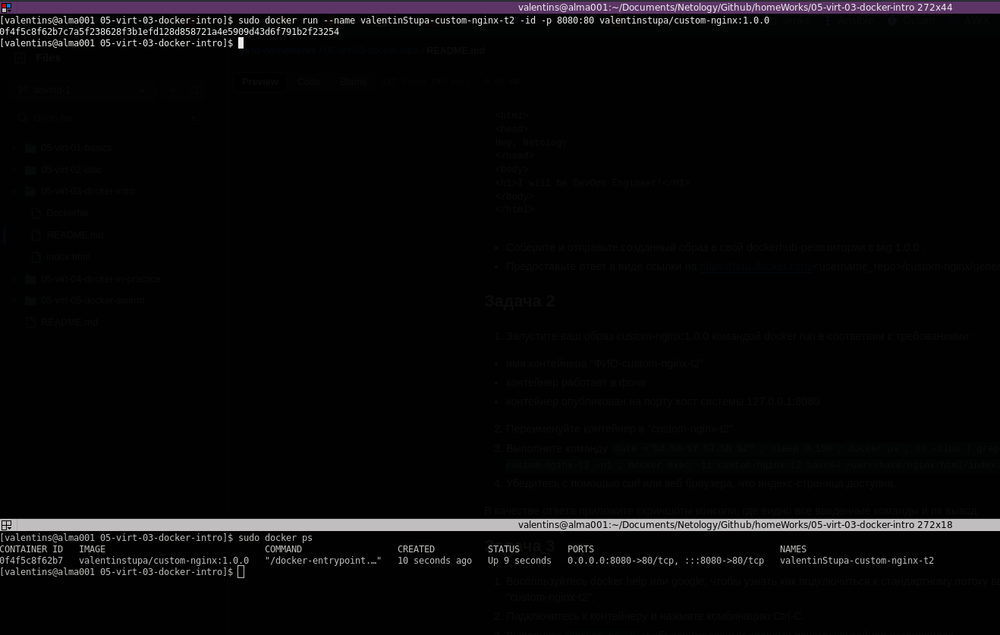

Docker rename:
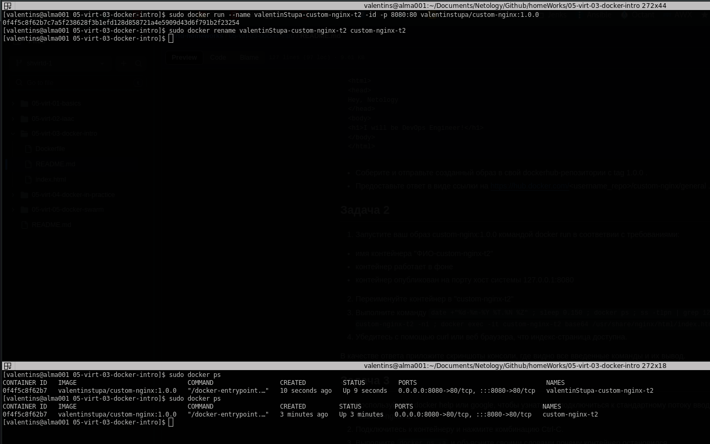

Curl:

## Задача 3:
Docker attach:
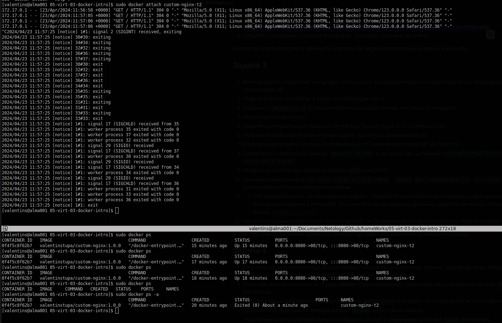

Change port v1:
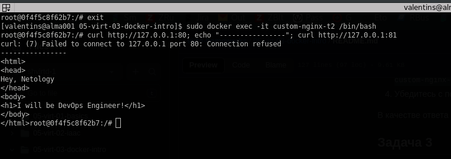

Change port v2*:
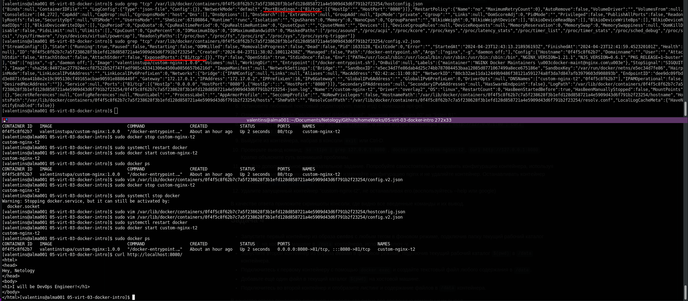

Unavaliable container port:
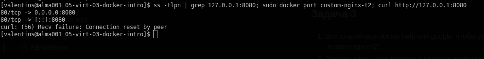

Remove container:
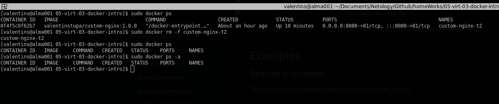

## Задача 4:
Docker mount volumes:
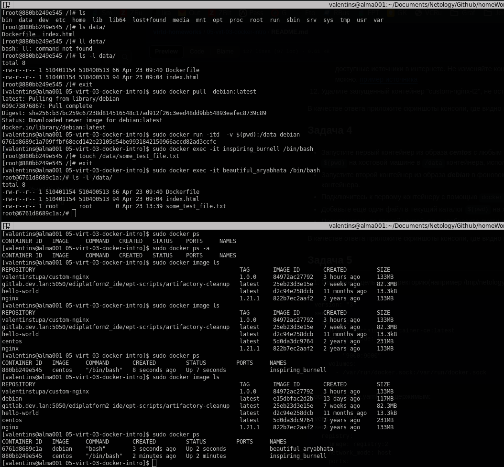

## Задача 5:
5.2:
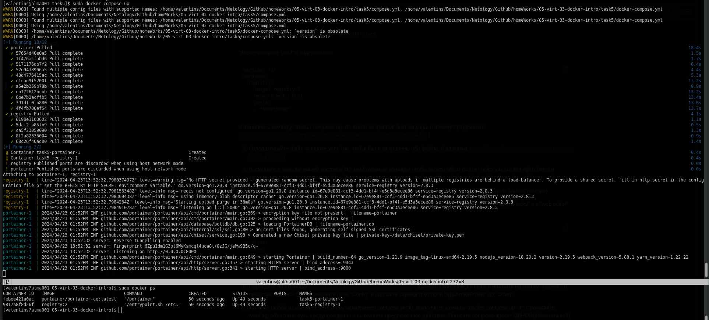

5.3:
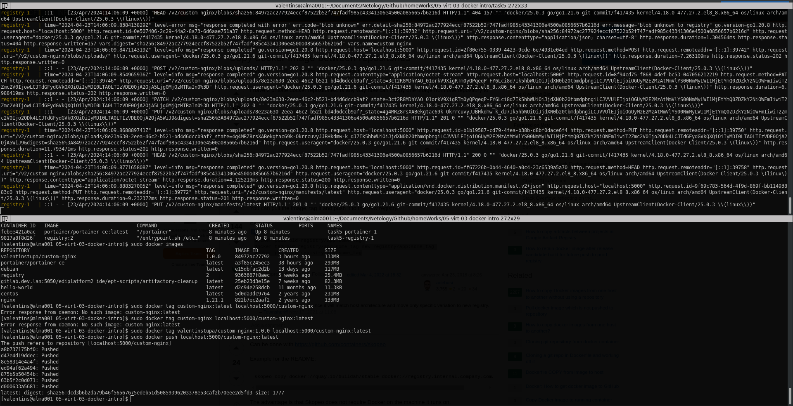

5.6 custom-nginx:
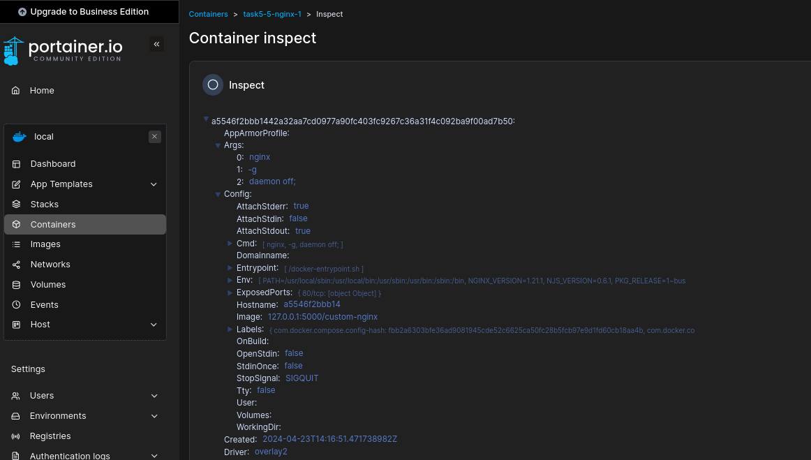

5.6 portainer:
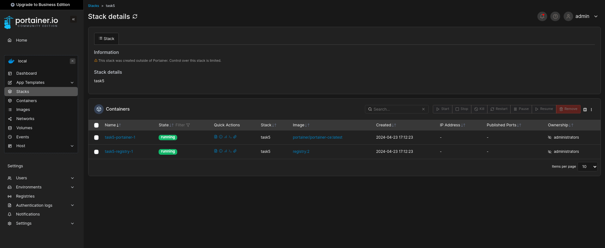

5.7:
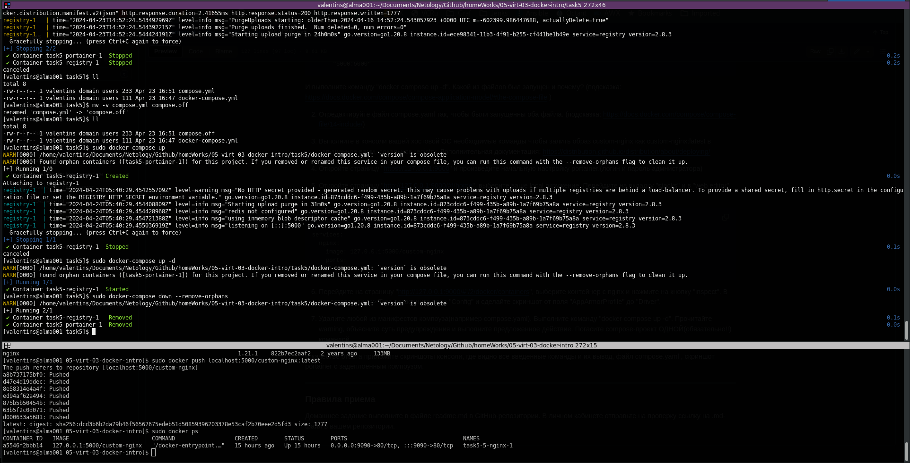

