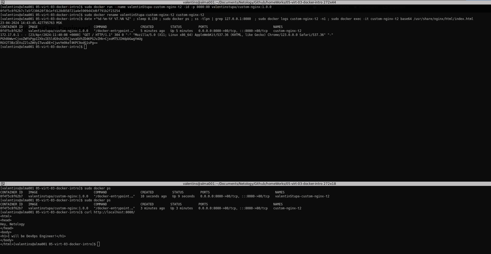

## Задача 1:
* [Docker Hub link](https://hub.docker.com/r/valentinstupa/custom-nginx/tags)
* P.S. Ссылка вида: "https://hub.docker.com/<username_repo>/custom-nginx/general" -- не работает

## Задача 2:
Docker run:

Docker rename:

Curl:

## Задача 3:
Docker attach:

Change port v1:

Change port v2*:

Unavaliable container port:

Remove container:

## Задача 4:
Docker mount volumes:

## Задача 5:
5.2:

5.3:

5.6 custom-nginx:

5.6 portainer:

5.7:

