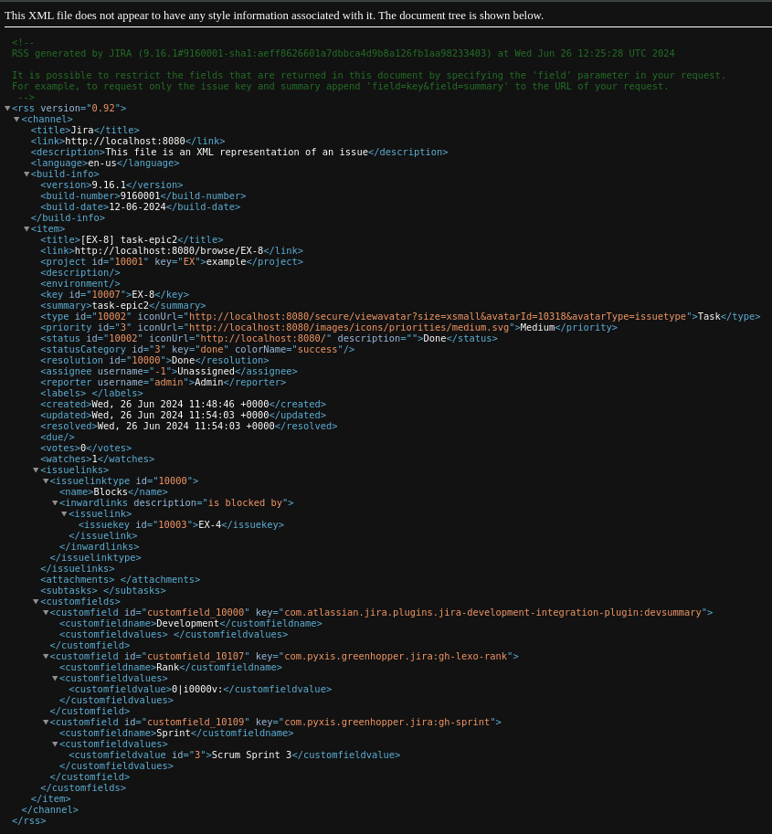

# Решение по заданию "Жизненный цикл ПО"
Для запуска jira через docker:\
[jira_docker](https://hub.docker.com/r/atlassian/jira-software/#)

``` 
docker pull atlassian/jira-software
docker volume create --name jiraVolume
docker run -v jiraVolume:/var/atlassian/application-data/jira --name="jira" -d -p 8080:8080 atlassian/jira-software
```
---
- Bug: [bug](./workflow/bug1-EX-3.xml)\

- Epic: [epic](./workflow/epic1-EX-4.xml)\

- Epic task1: [task1](./workflow/task-epic1-EX-7.xml)\

- Epic task2: [task2](./workflow/task-epic2-EX-8.xml)\
