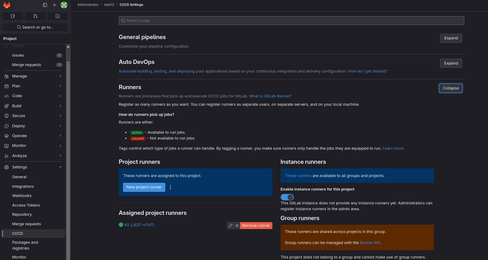
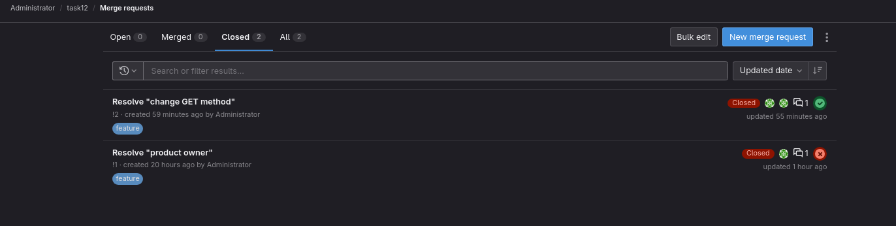

# Решение по заданию 12 "Gitlab"
## Подготовка:
- [Install Gitlab](https://medium.com/@srghimire061/how-to-install-and-configure-gitlab-ce-on-centos-8-7-dcc5da807e0f)
- [Install Runner](https://docs.gitlab.com/runner/install/linux-repository.html)
- [Register Runner](https://docs.gitlab.com/runner/register/index.html)
- Gitlab работает на 80 порту как и docker service. Если нужно сменить порт gitlab:\
Меняем в файле: `/etc/gitlab/gitlab.rb` в этой строке `external_url 'http://your_IP:8888'` с 80-->8888

- Включение регистри(по умолчанию не включен). В файле `/etc/gitlab/gitlab.rb` найти строки:
`registry_external_url 'http://your_IP:5050'`\
`registry['enable'] = true`\
`registry['dir'] = "/var/opt/gitlab/registry"`\
\
В файле `/var/opt/gitlab/gitlab-rails/etc/gitlab.yml` привести блок к такому виду:\
`  ## Container Registry`\
  `registry:`\
    `enabled: true`\
    `host: your_IP`\
    `port: 5050`\
    `api_url: http://127.0.0.1:5000 # internal address to the registry, will be used by GitLab to directly communicate with API`\
    `path: /var/opt/gitlab/gitlab-rails/shared/registry`\
    `key: /var/opt/gitlab/gitlab-rails/etc/gitlab-registry.key`\
    `issuer: omnibus-gitlab-issuer`\
    \
После всех изменений выполнить:\
`gitlab-ctl reconfigure`\
`gitlab-ctl restart`

- После смены порта нужно перепривязать раннер, а старый удалить из файла `/etc/gitlab-runner/config.toml` + [решение проблемы с недоступнустью докера](https://stackoverflow.com/questions/72216229/no-such-host-error-while-doing-docker-build-from-gitlab-ci?newreg=8912714878aa4ad4a40bd392445765c3)\
Ошибка: `dial tcp: lookup docker on 10.10.10.111:53: no such host`
- Ошибки докер демона `Cannot connect to the Docker daemon at tcp://docker:2375. Is the docker daemon running?`\
Добавить в pipeline в services переменные:\
`variables:  # not strictly needed, depending on runner configuration`\
  `DOCKER_HOST: "tcp://docker:2375"`\
  `DOCKER_TLS_CERTDIR: ""`\
  \
Чтобы не было ошибки https при логине в регистри нужно прописать это(заменить на ваш ip):\
`{ "insecure-registries": ["your_IP", "your_IP:5050", "your_IP:5000", "your_IP:8080", "your_IP:8443", "your_IP:8888", "localhost:32000"] }`\
В файл `/etc/docker/daemon.json`. Если нет, создать и перегрузить службу\
\
[Чтобы докер могу пушить в регистри](https://gitlab.com/gitlab-org/gitlab/-/issues/20810) нужно добавить в путь к `/etc/docker/daemon.json` в конфиге раннера `/etc/gitlab-runner/config.toml`\
`volumes = ["/cache", "/etc/docker/daemon.json:/etc/docker/daemon.json"]`
## Основные файлы
- [dockerfile](./Dockerfile)
- Runner\

- [gitlab-ci](./gitlab-cd.yml)
- Issue\

- [Pipeline log](./pipeline.log)