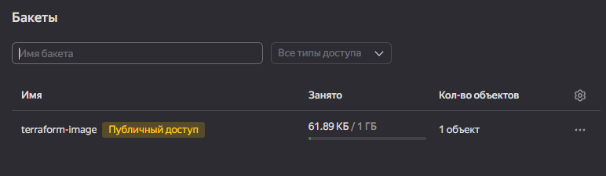
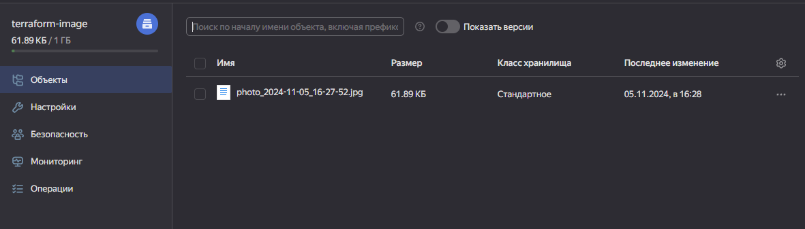
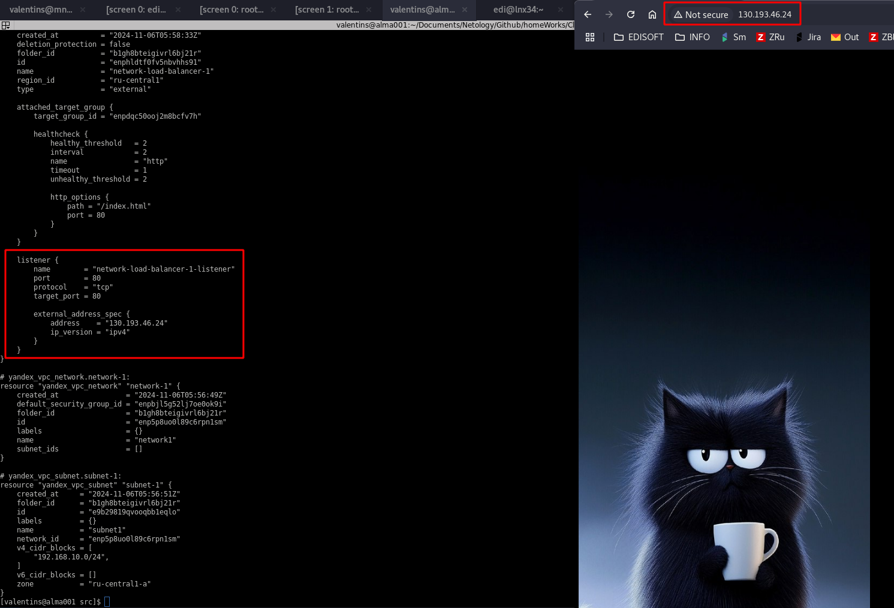
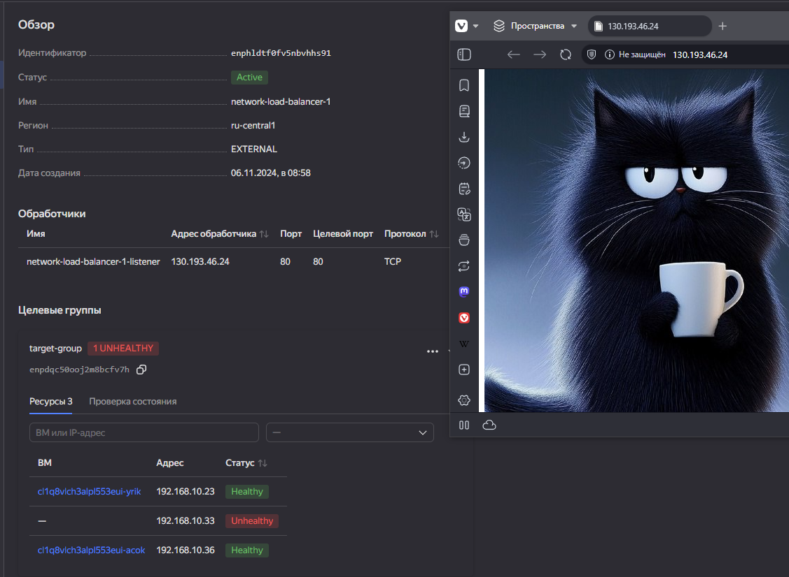
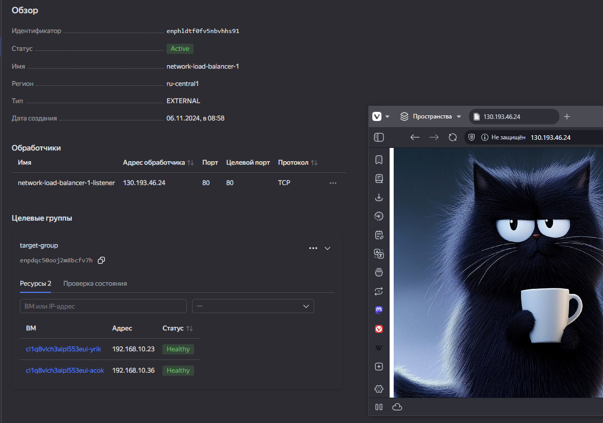

# Решение к заданию: "Вычислительные мощности/Балансировщики нагрузки"

1. Object Storage:\
    
    

---

2. [Instance Group](./terraform/src/main.tf)\
    [Cloud-init and web-link](./terraform/src/cloud-init.yml)

---

3. Network Balancer:\
    Доступ к публичному адресу/контенту:

    

    Удаление одной ВМ из группы:

    

    Сохранение доступа к контенту:
    


---
## Генерация отчета:
```
docker run --rm --volume "$(pwd):/terraform-docs" -u $(id -u) quay.io/terraform-docs/terraform-docs:0.18.0 markdown /terraform-docs
```
---


## Requirements

| Name | Version |
|------|---------|
| <a name="requirement_terraform"></a> [terraform](#requirement\_terraform) | >=1.5 |

## Providers

| Name | Version |
|------|---------|
| <a name="provider_template"></a> [template](#provider\_template) | 2.2.0 |
| <a name="provider_yandex"></a> [yandex](#provider\_yandex) | 0.123.0 |

## Modules

No modules.

## Resources

| Name | Type |
|------|------|
| [yandex_compute_instance_group.ig-1](https://registry.terraform.io/providers/yandex-cloud/yandex/latest/docs/resources/compute_instance_group) | resource |
| [yandex_lb_network_load_balancer.lb-1](https://registry.terraform.io/providers/yandex-cloud/yandex/latest/docs/resources/lb_network_load_balancer) | resource |
| [yandex_vpc_network.network-1](https://registry.terraform.io/providers/yandex-cloud/yandex/latest/docs/resources/vpc_network) | resource |
| [yandex_vpc_subnet.subnet-1](https://registry.terraform.io/providers/yandex-cloud/yandex/latest/docs/resources/vpc_subnet) | resource |
| [template_file.cloudinit](https://registry.terraform.io/providers/hashicorp/template/latest/docs/data-sources/file) | data source |

## Inputs

| Name | Description | Type | Default | Required |
|------|-------------|------|---------|:--------:|
| <a name="input_cloud_id"></a> [cloud\_id](#input\_cloud\_id) | https://cloud.yandex.ru/docs/resource-manager/operations/cloud/get-id | `string` | n/a | yes |
| <a name="input_default_zone"></a> [default\_zone](#input\_default\_zone) | https://cloud.yandex.ru/docs/overview/concepts/geo-scope | `string` | `"ru-central1-a"` | no |
| <a name="input_disk_size"></a> [disk\_size](#input\_disk\_size) | Disk size | `string` | `"10"` | no |
| <a name="input_folder_id"></a> [folder\_id](#input\_folder\_id) | https://cloud.yandex.ru/docs/resource-manager/operations/folder/get-id | `string` | n/a | yes |
| <a name="input_metadata"></a> [metadata](#input\_metadata) | n/a | `map(any)` | <pre>{<br>  "serial-port-enable": 1,<br>  "ssh-keys": "almalinux:ssh-ed25519 AAAAC3NzaC1lZDI1NTE5AAAAIEI4AI6/iSUW6k+H8SU5AW7z4wxVZooyapkkXa88tuL2"<br>}</pre> | no |
| <a name="input_package"></a> [package](#input\_package) | Packages | `string` | `"nginx"` | no |
| <a name="input_private_cidr"></a> [private\_cidr](#input\_private\_cidr) | https://cloud.yandex.ru/docs/vpc/operations/subnet-create | `list(string)` | <pre>[<br>  "192.168.20.0/24"<br>]</pre> | no |
| <a name="input_public_cidr"></a> [public\_cidr](#input\_public\_cidr) | https://cloud.yandex.ru/docs/vpc/operations/subnet-create | `list(string)` | <pre>[<br>  "192.168.10.0/24"<br>]</pre> | no |
| <a name="input_token"></a> [token](#input\_token) | OAuth-token; https://cloud.yandex.ru/docs/iam/concepts/authorization/oauth-token | `string` | n/a | yes |
| <a name="input_username"></a> [username](#input\_username) | Ssh user | `string` | `"almalinux"` | no |
| <a name="input_vpc_image"></a> [vpc\_image](#input\_vpc\_image) | OS image name | `string` | `"almalinux-8"` | no |
| <a name="input_vpc_name"></a> [vpc\_name](#input\_vpc\_name) | VPC network & subnet name | `string` | `"develop"` | no |
| <a name="input_vpc_platform_id"></a> [vpc\_platform\_id](#input\_vpc\_platform\_id) | Platform ID | `string` | `"standard-v1"` | no |

## Outputs

No outputs.
