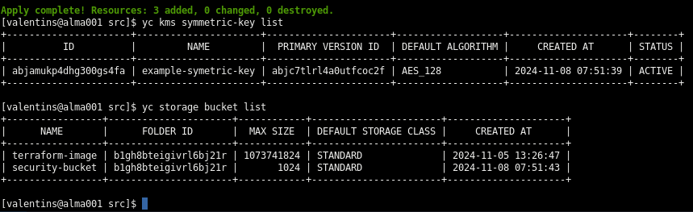
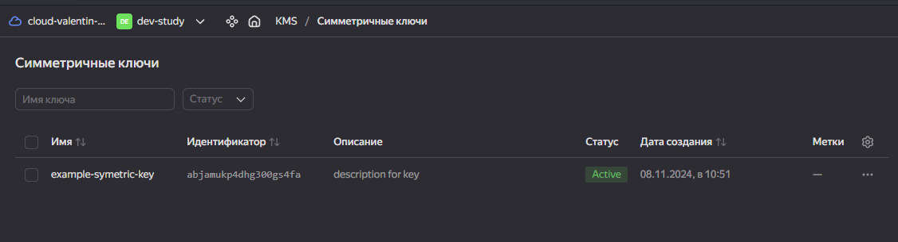
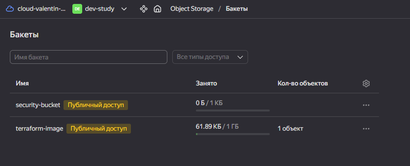
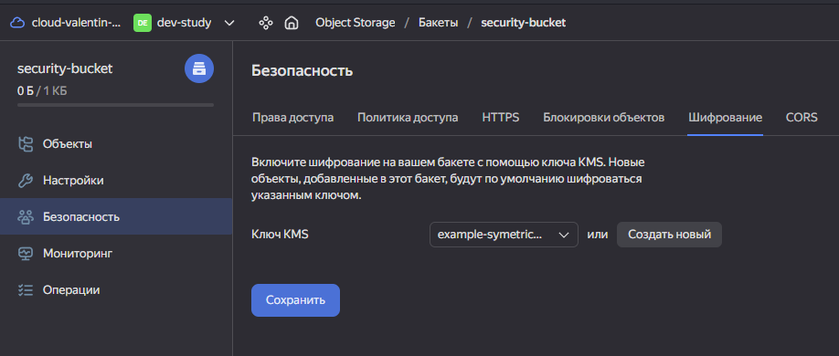
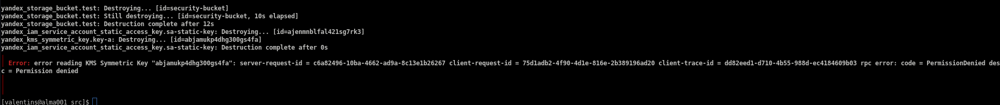
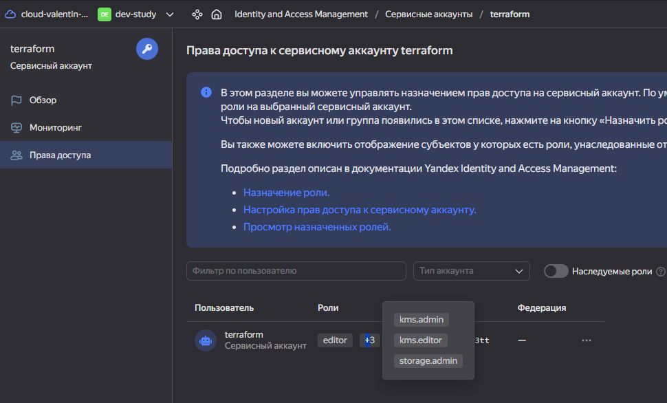

# Решение к занятию: "Безопасность в облачных провайдерах"
* Создание bucket и kms ключа шифрования:
    - Результат выполнения кода(bucket|kms key):
    

    - Symetric Kms key(симметричный ключ):
    

    - Secur bucket:
    

    - Assign kms key for bucket:
    

---
### Проблемы с удалением kms ключа от лица сервисного аккаунта
Ошибка:

Хотя набора прав достаточно для управления:

