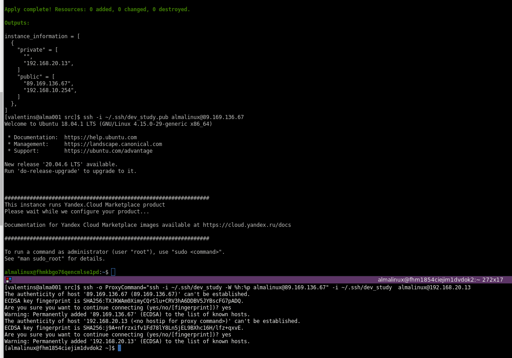
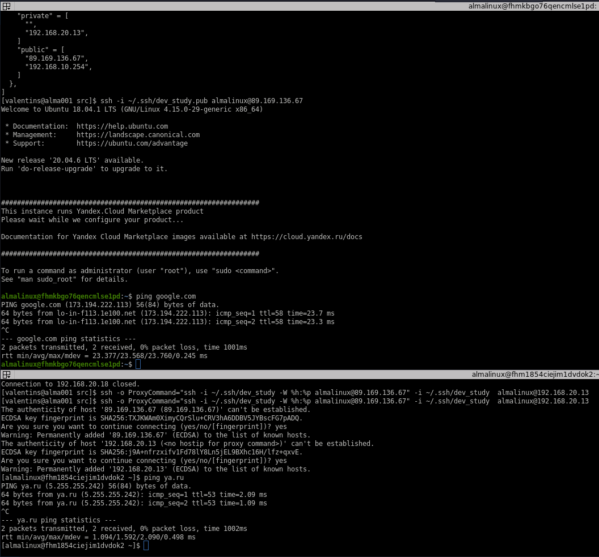

# Решение к домашнему заданию:"Организация сети"

* Первое подключение:\


* Проверка доступа:\

---
[Подключение к private VM через public VM c локальной:](https://yandex.cloud/ru/docs/tutorials/routing/nat-instance/terraform#test)
```
ssh -o ProxyCommand="ssh -i ~/.ssh/dev_study -W %h:%p user@EXT_IP" -i ~/.ssh/dev_study  user@INT_IP
```
---

## Requirements

| Name | Version |
|------|---------|
| <a name="requirement_terraform"></a> [terraform](#requirement\_terraform) | >=1.5 |

## Providers

| Name | Version |
|------|---------|
| <a name="provider_yandex"></a> [yandex](#provider\_yandex) | 0.123.0 |

## Modules

No modules.

## Resources

| Name | Type |
|------|------|
| [yandex_compute_instance.nat-instance](https://registry.terraform.io/providers/yandex-cloud/yandex/latest/docs/resources/compute_instance) | resource |
| [yandex_compute_instance.private](https://registry.terraform.io/providers/yandex-cloud/yandex/latest/docs/resources/compute_instance) | resource |
| [yandex_vpc_network.develop](https://registry.terraform.io/providers/yandex-cloud/yandex/latest/docs/resources/vpc_network) | resource |
| [yandex_vpc_route_table.nat-instance-route](https://registry.terraform.io/providers/yandex-cloud/yandex/latest/docs/resources/vpc_route_table) | resource |
| [yandex_vpc_security_group.nat-instance-sg](https://registry.terraform.io/providers/yandex-cloud/yandex/latest/docs/resources/vpc_security_group) | resource |
| [yandex_vpc_subnet.private](https://registry.terraform.io/providers/yandex-cloud/yandex/latest/docs/resources/vpc_subnet) | resource |
| [yandex_vpc_subnet.public](https://registry.terraform.io/providers/yandex-cloud/yandex/latest/docs/resources/vpc_subnet) | resource |
| [yandex_compute_image.image](https://registry.terraform.io/providers/yandex-cloud/yandex/latest/docs/data-sources/compute_image) | data source |

## Inputs

| Name | Description | Type | Default | Required |
|------|-------------|------|---------|:--------:|
| <a name="input_cloud_id"></a> [cloud\_id](#input\_cloud\_id) | https://cloud.yandex.ru/docs/resource-manager/operations/cloud/get-id | `string` | n/a | yes |
| <a name="input_default_zone"></a> [default\_zone](#input\_default\_zone) | https://cloud.yandex.ru/docs/overview/concepts/geo-scope | `string` | `"ru-central1-a"` | no |
| <a name="input_disk_size"></a> [disk\_size](#input\_disk\_size) | Disk size | `string` | `"10"` | no |
| <a name="input_folder_id"></a> [folder\_id](#input\_folder\_id) | https://cloud.yandex.ru/docs/resource-manager/operations/folder/get-id | `string` | n/a | yes |
| <a name="input_metadata"></a> [metadata](#input\_metadata) | n/a | `map(any)` | <pre>{<br>  "serial-port-enable": 1,<br>  "ssh-keys": "almalinux:ssh-ed25519 AAAAC3NzaC1lZDI1NTE5AAAAIEI4AI6/iSUW6k+H8SU5AW7z4wxVZooyapkkXa88tuL2"<br>}</pre> | no |
| <a name="input_private_cidr"></a> [private\_cidr](#input\_private\_cidr) | https://cloud.yandex.ru/docs/vpc/operations/subnet-create | `list(string)` | <pre>[<br>  "192.168.20.0/24"<br>]</pre> | no |
| <a name="input_public_cidr"></a> [public\_cidr](#input\_public\_cidr) | https://cloud.yandex.ru/docs/vpc/operations/subnet-create | `list(string)` | <pre>[<br>  "192.168.10.0/24"<br>]</pre> | no |
| <a name="input_ssh_key_path"></a> [ssh\_key\_path](#input\_ssh\_key\_path) | n/a | `string` | n/a | yes |
| <a name="input_token"></a> [token](#input\_token) | OAuth-token; https://cloud.yandex.ru/docs/iam/concepts/authorization/oauth-token | `string` | n/a | yes |
| <a name="input_vm_user"></a> [vm\_user](#input\_vm\_user) | n/a | `string` | n/a | yes |
| <a name="input_vm_user_nat"></a> [vm\_user\_nat](#input\_vm\_user\_nat) | n/a | `string` | n/a | yes |
| <a name="input_vpc_image"></a> [vpc\_image](#input\_vpc\_image) | OS image name | `string` | `"almalinux-8"` | no |
| <a name="input_vpc_name"></a> [vpc\_name](#input\_vpc\_name) | VPC network & subnet name | `string` | `"develop"` | no |
| <a name="input_vpc_platform_id"></a> [vpc\_platform\_id](#input\_vpc\_platform\_id) | Platform ID | `string` | `"standard-v1"` | no |

## Outputs

| Name | Description |
|------|-------------|
| <a name="output_instance_information"></a> [instance\_information](#output\_instance\_information) | n/a |
