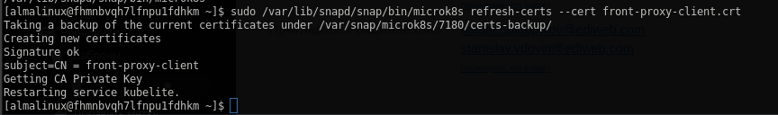
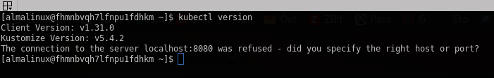

# Домашнее задание:"Введение в K8s/kubectl"
1. MicroK8s:\
\
Dashboard:\
\
Generate certs:\
\
2. Kubectl version:\
\
Port-Forward:
\
---
\
Отчет:
```docker run --rm --volume "$(pwd):/terraform-docs" -u $(id -u) quay.io/terraform-docs/terraform-docs:0.18.0 markdown /terraform-docs```
## Requirements

| Name | Version |
|------|---------|
| <a name="requirement_terraform"></a> [terraform](#requirement\_terraform) | >=1.5 |

## Providers

| Name | Version |
|------|---------|
| <a name="provider_yandex"></a> [yandex](#provider\_yandex) | 0.123.0 |

## Modules

No modules.

## Resources

| Name | Type |
|------|------|
| [yandex_compute_instance.vm_1](https://registry.terraform.io/providers/yandex-cloud/yandex/latest/docs/resources/compute_instance) | resource |
| [yandex_vpc_network.develop](https://registry.terraform.io/providers/yandex-cloud/yandex/latest/docs/resources/vpc_network) | resource |
| [yandex_vpc_subnet.develop](https://registry.terraform.io/providers/yandex-cloud/yandex/latest/docs/resources/vpc_subnet) | resource |
| [yandex_compute_image.centos](https://registry.terraform.io/providers/yandex-cloud/yandex/latest/docs/data-sources/compute_image) | data source |

## Inputs

| Name | Description | Type | Default | Required |
|------|-------------|------|---------|:--------:|
| <a name="input_cloud_id"></a> [cloud\_id](#input\_cloud\_id) | https://cloud.yandex.ru/docs/resource-manager/operations/cloud/get-id | `string` | n/a | yes |
| <a name="input_default_cidr"></a> [default\_cidr](#input\_default\_cidr) | https://cloud.yandex.ru/docs/vpc/operations/subnet-create | `list(string)` | <pre>[<br>  "10.0.1.0/24"<br>]</pre> | no |
| <a name="input_default_zone"></a> [default\_zone](#input\_default\_zone) | https://cloud.yandex.ru/docs/overview/concepts/geo-scope | `string` | `"ru-central1-b"` | no |
| <a name="input_folder_id"></a> [folder\_id](#input\_folder\_id) | https://cloud.yandex.ru/docs/resource-manager/operations/folder/get-id | `string` | n/a | yes |
| <a name="input_metadata"></a> [metadata](#input\_metadata) | n/a | `map(any)` | <pre>{<br>  "serial-port-enable": 1,<br>  "ssh-keys": "almalinux:ssh-ed25519 AAAAC3NzaC1lZDI1NTE5AAAAIEI4AI6/iSUW6k+H8SU5AW7z4wxVZooyapkkXa88tuL2"<br>}</pre> | no |
| <a name="input_token"></a> [token](#input\_token) | OAuth-token; https://cloud.yandex.ru/docs/iam/concepts/authorization/oauth-token | `string` | n/a | yes |
| <a name="input_vpc_name"></a> [vpc\_name](#input\_vpc\_name) | VPC network & subnet name | `string` | `"develop"` | no |
| <a name="input_vpc_platform_id"></a> [vpc\_platform\_id](#input\_vpc\_platform\_id) | Platform ID | `string` | `"standard-v1"` | no |

## Outputs

| Name | Description |
|------|-------------|
| <a name="output_instance_information"></a> [instance\_information](#output\_instance\_information) | n/a |
