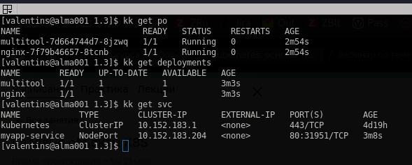
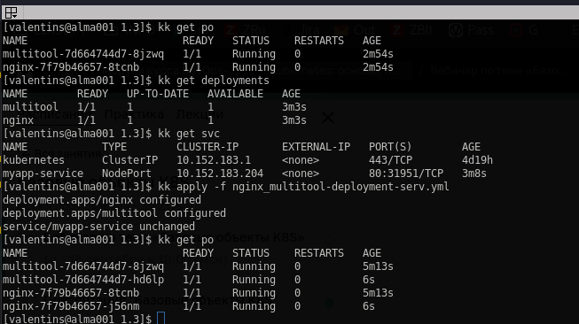
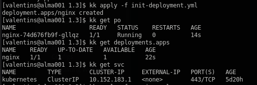
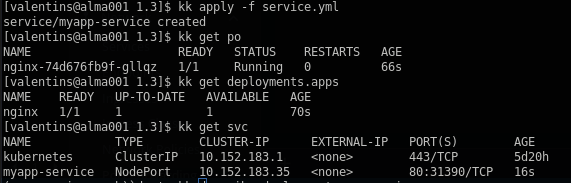
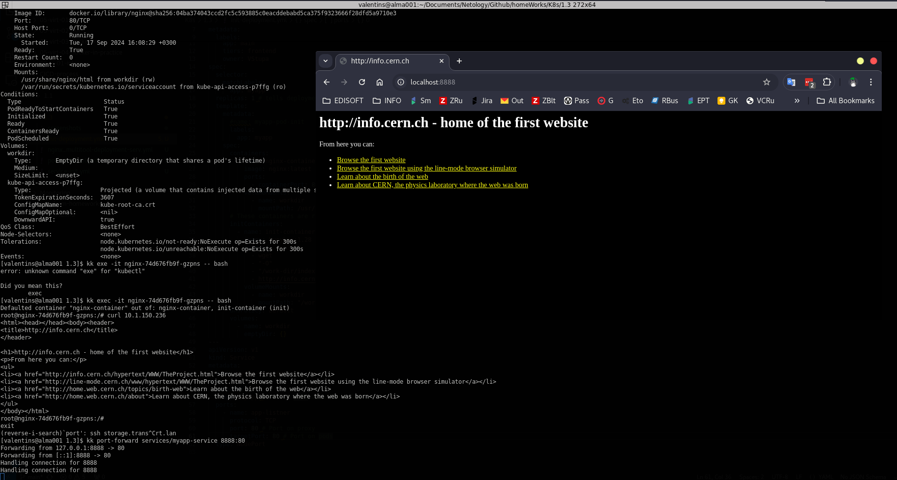

# Решение к домашнему заданию: "Запуск приложений в К8S"
1. Deployment one replica:\
\
Deployment two replicas: [deployment](./nginx_multitool-deployment-serv.yml)\
\
Отдельный под multitool + curl + port-forward: [pod-multitool](./pod-multitool.yml)\

---
2.
Init contaner: [init-pod](./init-deployment.yml) \
\
Deployment без сервиса:\
\
Deployment c сервисом: [service](./service.yml) \
\
Curl outside/inside container:\

