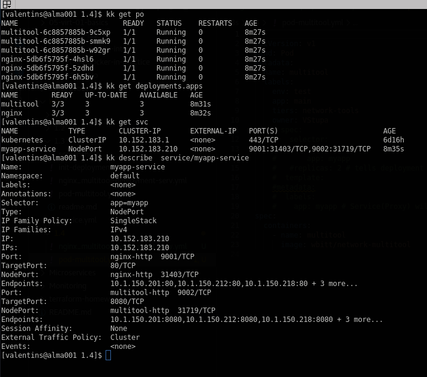
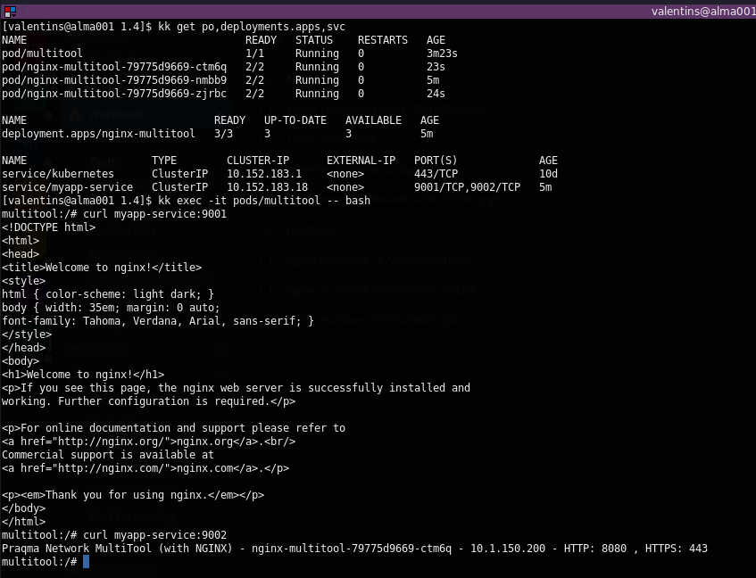
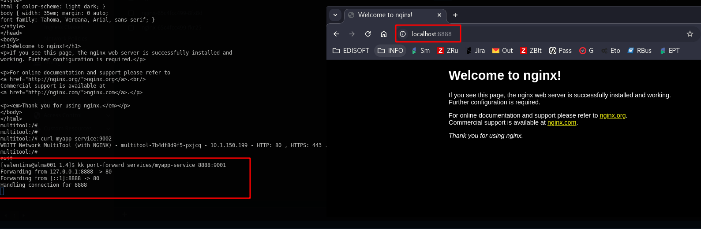
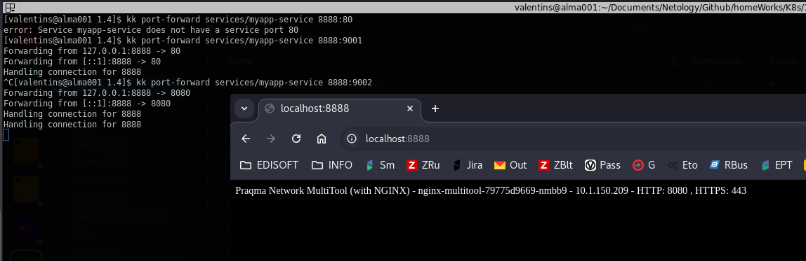

# Решение к домашнему заданию: "Сетевое взаимодействие в K8S -- Part 1"
1. Deployment:\
\
Curl from diffirent multitool pod:
\
Port-forward nginx:\
\
Port-forward multitool:\
\
Manifest file: [Nginx+multitool+service](./deployment.yml)
---
2. Manifest file: [Service+NodePort](./service.yml):

