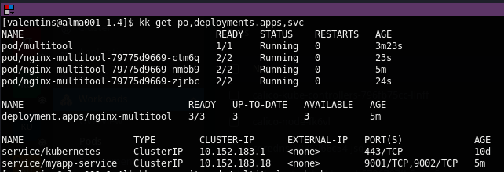

# Решение к домашнему заданию: "Сетевое взаимодействие в K8S -- Part 1"
1. Deployment:\
\
Curl from diffirent multitool pod:
\
Port-forward:\
\
Manifest file: [Nginx+multitool+service](nginx_multitool-deployment-serv.yml)
---
2. [Service+NodePort](./service.yml):

