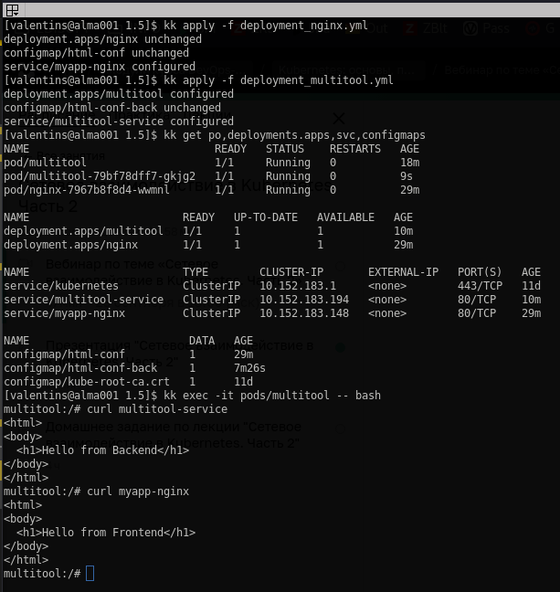
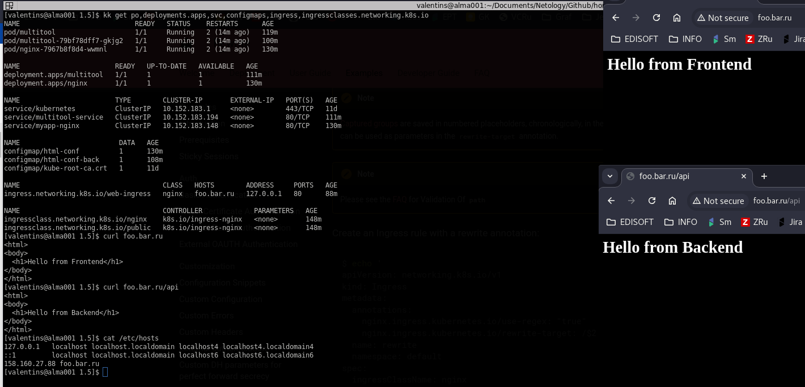

# Решение к домашнему заданию: "Сетевое взаимодействие в K8S -- Part 2"
1. Frontend/Backend:
- [deploymen frontend](./deployment_nginx.yml)
- [deployment backend](./deployment_multitool.yml)

2. Ingress -- external access:
- [ingress manifest](ingress.yml)
