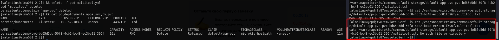

# Решение к домашнему заданию: «Хранение в K8s -- Part 2»
1. [Local PV](./pv-local.yml)\
[Deployment](./deployment_multitool.yml)\
Local Store:\
\
Delete PVC:\
\
Delete PV:\
\
Все файлы остаются на рабочей ноде из-за параметра: "hostPath" + политики "Retain" описанные в [Local PV](./pv-local.yml)
---
2. [Pod](./pod-multitool.yml)\
StorageClass:\
\
StorageClass Remove:\
\
После удаления пода запрошенное место освобождается с удалением данных.

