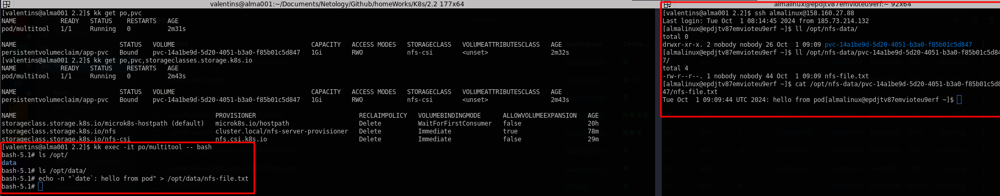

# Решение к домашнему заданию: «Хранение в K8s -- Part 2»
1. [Local PV](./pv-local.yml)\
[Deployment](./deployment_multitool.yml)\
Local Store:\
\
Delete PVC:\
\
Delete PV:\
\
Все файлы остаются на рабочей ноде из-за параметра: "hostPath" + политики "Retain" описанные в [Local PV](./pv-local.yml)
---
2. [Pod](./pod-multitool.yml)\
StorageClass:\
\
StorageClass access:\
\
После удаления пода запрошенное место(pv) удаляется с удалением данных из-за политики "reclaimPolicy: Delete"
---
### Requirement:
- [Activate NFS-csi storage class on microk8s](https://microk8s.io/docs/how-to-nfs)\
On RedHat family:
```
sudo yum install nfs-utils -y
sudo vim /etc/exports
[almalinux@epdjtv87emvioteu9erf ~]$ cat /etc/exports
/opt/nfs-data/	10.0.0.0/8(rw,sync,no_subtree_check)
sudo mkdir /opt/nfs-data
sudo chown nobody:nobody /opt/nfs-data
sudo chmod 0777 /opt/nfs-data
sudo systemctl start nfs-server.service 
sudo systemctl status nfs-server.service
#---
Add repo csi-driver-nfs:

[almalinux@epdjtv87emvioteu9erf ~]$ microk8s helm3 repo add csi-driver-nfs https://raw.githubusercontent.com/kubernetes-csi/csi-driver-nfs/master/charts
"csi-driver-nfs" has been added to your repositories
[almalinux@epdjtv87emvioteu9erf ~]$ microk8s helm3 repo update
Hang tight while we grab the latest from your chart repositories...
...Successfully got an update from the "csi-driver-nfs" chart repository
Update Complete. ⎈Happy Helming!⎈
#---
Install csi-driver-nfs:

[almalinux@epdjtv87emvioteu9erf ~]$ microk8s helm3 install csi-driver-nfs csi-driver-nfs/csi-driver-nfs     --namespace kube-system     --set kubeletDir=/var/snap/microk8s/common/var/lib/kubelet
NAME: csi-driver-nfs
LAST DEPLOYED: Tue Oct  1 06:16:19 2024
NAMESPACE: kube-system
STATUS: deployed
REVISION: 1
TEST SUITE: None
NOTES:
The CSI NFS Driver is getting deployed to your cluster.

To check CSI NFS Driver pods status, please run:

  kubectl --namespace=kube-system get pods --selector="app.kubernetes.io/instance=csi-driver-nfs" --watch
#---
If succeesed, you should see:

[almalinux@epdjtv87emvioteu9erf ~]$ microk8s kubectl wait pod --selector app.kubernetes.io/name=csi-driver-nfs --for condition=ready --namespace kube-system
pod/csi-nfs-controller-6dc8bc7767-drmkn condition met
pod/csi-nfs-node-9s8zr condition met
```


