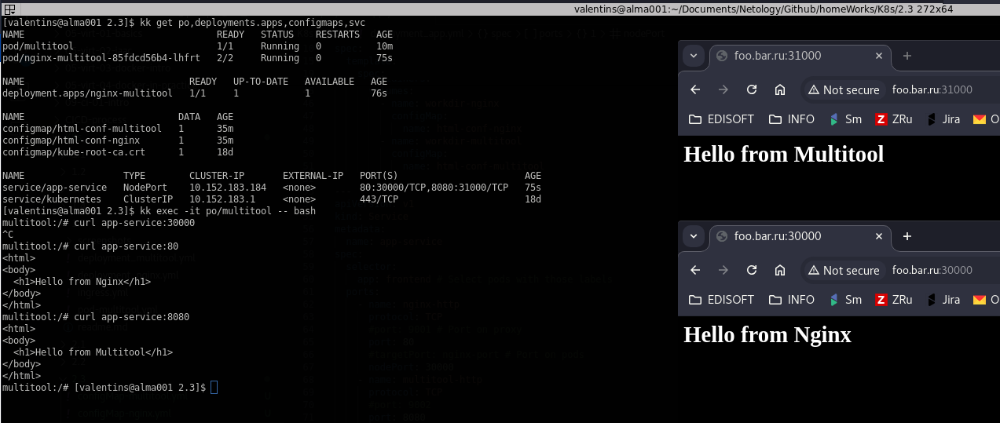
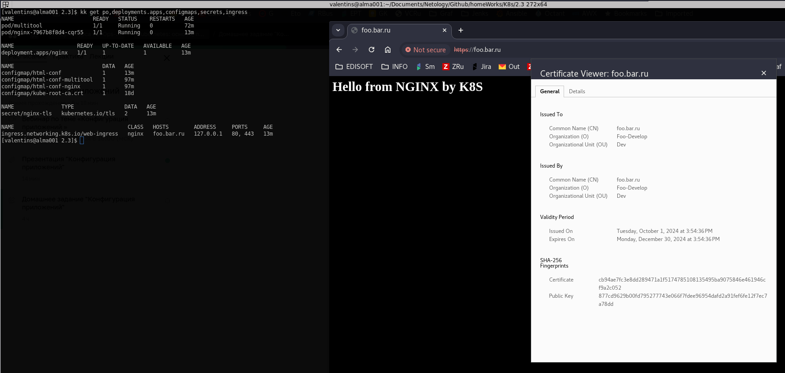

# Решение к домашнему заданию: "Конфигурация приложений"
1. [Deployment app](./deployment_app.yml)
* [Config Map Multitool](./configMap-multitool.yml)
* [Config Map Nginx](./configMap-nginx.yml)\

---
2. [Deployment Nginx](./deployment_nginx.yml)
* [Ingress](./ingress.yml)\

---
### Requirements:
To generate self-signed certificate
```
openssl req -newkey rsa:2048 -nodes -keyout foo.bar.ru.key -x509 -days 90 -out foo.bar.ru.crt
```
To get base64 format for k8s:
```
cat foo.bar.ru.crt | base64
cat foo.bar.ru.key | base64
```
Past the output on one line into your secret file