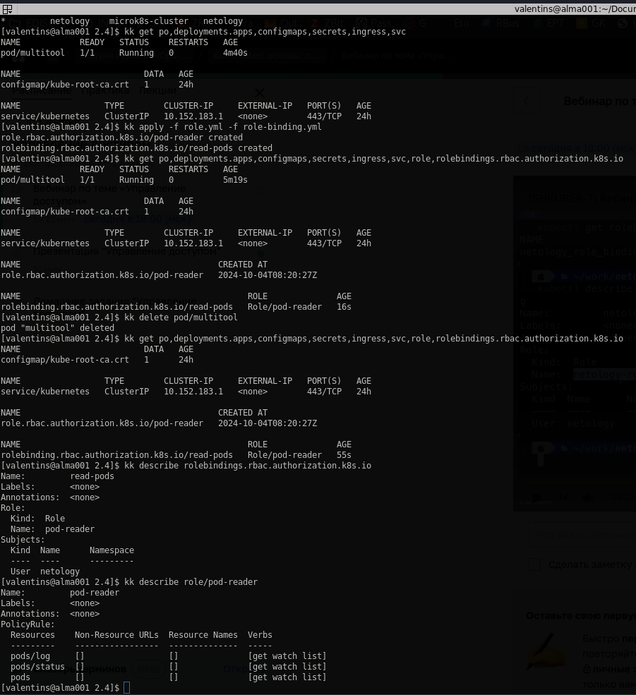
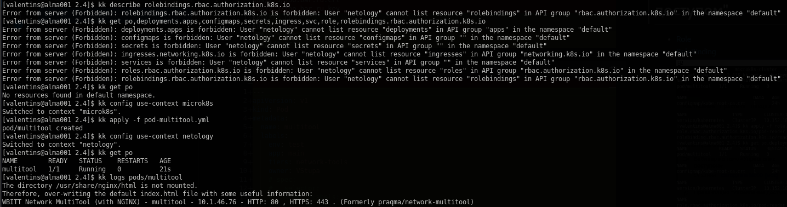
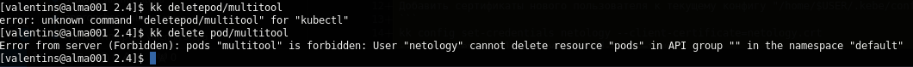

# Решение к домашнему заданию: "Управление доступом"
* [Role](./role.yml)
* [RoleBinding](./role-binding.yml)\
\
\


---
Создание сертификатов для нового пользователя "netology"(ca.crt/ca/key -- взять с кластера k8s):
```
 openssl genrsa -out netology.key 2048
 openssl req -new -key netology.key -out netology.csr -subj "/CN=netology/O=ops"
 openssl x509 -req -in netology.csr -CA ca.crt -CAkey ca.key -CAcreateserial -out netology.crt -days 500
 ```
 ---
 Добавить сертификаты нового пользователя к текущему конфигу "/home/$USER/.kebe/config":
 ```
 kk config set-credentials netology --client-certificate=netology.crt --client-key=netology.key --embed-certs=true
 ```
 Присвоить кластер новому пользователю:
 ```
 kk config set-context netology --cluster=microk8s-cluster --user=netology
 ```
 Включить поддержку RBAC в microk8s
 ```
 microk8s enable rbac
 ```