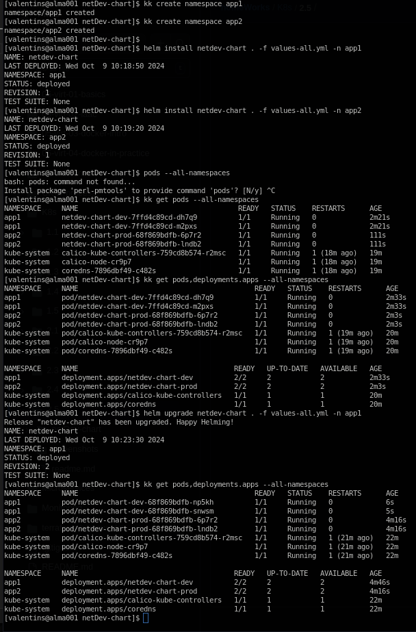
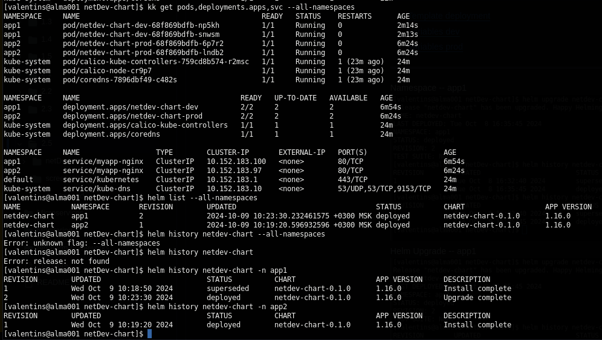

# Решение к домашнему заданию: "Helm"
```
helm create netDev-chart
helm template dev-chart . -f values-all.yml
helm install netdev-chart . -f values-all.yml
helm install netdev-chart . -f values-all.yml -n app1
helm list
helm list -n app1
helm history netdev-chart
helm history netdev-chart -n app1
helm upgrade netdev-chart . -f values-all.yml -n app1
```
- [Template deployment](./netDev-chart/templates/deployment_nginx.yml)
- [Template service](./netDev-chart/templates/service.yml)
- [Variables All](./netDev-chart/values-all.yml)
---
Install/Upgrade namespace -app1:\
\
Show revision:\
\
Namespace -- app1\
\
Helm Upgrade -- app1\
\
Namespace -- app2\

---
Fresh install microk8s:
```
sudo snap remove microk8s
sudo snap install microk8s --classic --channel=1.31/stable
microk8s status --wait-ready
vim /var/snap/microk8s/current/certs/csr.conf.template -- past your ext IP
sudo /var/lib/snapd/snap/bin/microk8s refresh-certs --cert front-proxy-client.crt
microk8s config -- get config and setting up on your local VM
```