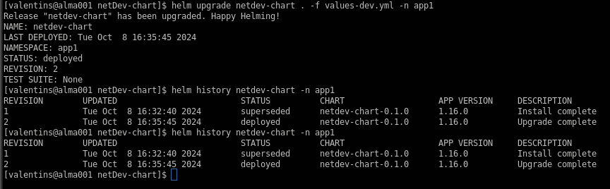
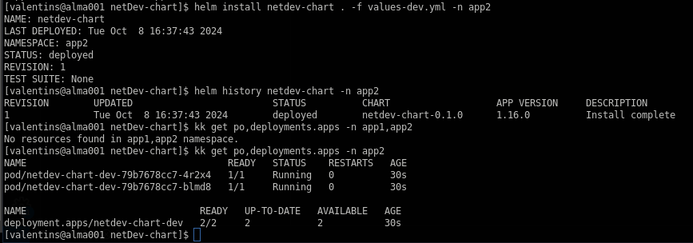

# Решение к домашнему заданию: "Helm"
```
helm create netDev-chart
helm template dev-chart . -f values-dev.yml
helm install netdev-chart . -f values-dev.yml
helm install netdev-chart . -f values-dev.yml -n app1
helm list
helm list -n app1
helm history netdev-chart
helm history netdev-chart -n app1
```
- [Template deployment](./netDev-chart/templates/deployment_nginx.yml)
- [Variables dev](./netDev-chart/values-dev.yml)
- [Variables prod](./netDev-chart/values-prod.yml)
---
Namespace -- app1\
\
Helm Upgrade -- app1\
\
Namespace -- app2\

