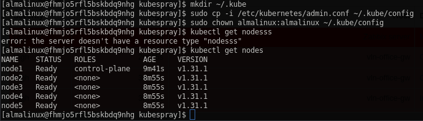

## Решение к домашнему заданию: "Установка k8s с помощью kubespray/kubeadm"
Mini HowTo:
```
sudo yum install python3.11 python3.11-pip git vim -y
git clone https://github.com/kubernetes-incubator/kubespray
cd kubespray/ && python3.11 -m pip install -r requirements.txt
cp -rfp inventory/sample inventory/mycluster
```
указываем внутренние адреса наших хостов
```
declare -a IPS=(10.0.1.24 10.0.1.6 10.0.1.25 10.0.1.8 10.0.1.31)
```
```
pip3.11 install ruamel.yaml
CONFIG_FILE=inventory/mycluster/hosts.yaml python3.11 contrib/inventory_builder/inventory.py ${IPS[@]}
```
редактируем файл так, чтобы мастер был 1, другие воркерами + прописать ansible_ssh_private_key_file:
```
vim inventory/mycluster/hosts.yaml 

all:
  hosts:
    node1:
      ansible_host: 10.0.1.24
      ip: 10.0.1.24
      access_ip: 10.0.1.24
      ansible_ssh_private_key_file: ~/.ssh/id_key
```
вставить содержимое, которое указывается в metadata у terrafom(тот же ключ, что и для подключения с локальной ВМ к облачной)
```
vim ~/.ssh/id_key
chmod 600 ~/.ssh/id_key
```
Активируем включение "helm"
```
vim inventory/mycluster/group_vars/k8s_cluster/addons.yml -- helm = true
```
Запускаем
```
ansible-playbook -i inventory/mycluster/hosts.yaml cluster.yml -b -v
```
После завершения:
```
mkdir ~/.kube
sudo cp -i /etc/kubernetes/admin.conf ~/.kube/config
sudo chown `id -u`:`id -g` ~/.kube/config 
kubectl get nodes
```
Получаем готовый кластер:

---
## Requirements

| Name | Version |
|------|---------|
| <a name="requirement_terraform"></a> [terraform](#requirement\_terraform) | >=1.5 |

## Providers

| Name | Version |
|------|---------|
| <a name="provider_yandex"></a> [yandex](#provider\_yandex) | 0.123.0 |

## Modules

No modules.

## Resources

| Name | Type |
|------|------|
| [yandex_compute_instance.vm_1](https://registry.terraform.io/providers/yandex-cloud/yandex/latest/docs/resources/compute_instance) | resource |
| [yandex_compute_instance.vm_2](https://registry.terraform.io/providers/yandex-cloud/yandex/latest/docs/resources/compute_instance) | resource |
| [yandex_compute_instance.vm_3](https://registry.terraform.io/providers/yandex-cloud/yandex/latest/docs/resources/compute_instance) | resource |
| [yandex_compute_instance.vm_4](https://registry.terraform.io/providers/yandex-cloud/yandex/latest/docs/resources/compute_instance) | resource |
| [yandex_compute_instance.vm_5](https://registry.terraform.io/providers/yandex-cloud/yandex/latest/docs/resources/compute_instance) | resource |
| [yandex_vpc_network.develop](https://registry.terraform.io/providers/yandex-cloud/yandex/latest/docs/resources/vpc_network) | resource |
| [yandex_vpc_subnet.develop](https://registry.terraform.io/providers/yandex-cloud/yandex/latest/docs/resources/vpc_subnet) | resource |
| [yandex_compute_image.image](https://registry.terraform.io/providers/yandex-cloud/yandex/latest/docs/data-sources/compute_image) | data source |

## Inputs

| Name | Description | Type | Default | Required |
|------|-------------|------|---------|:--------:|
| <a name="input_cloud_id"></a> [cloud\_id](#input\_cloud\_id) | https://cloud.yandex.ru/docs/resource-manager/operations/cloud/get-id | `string` | n/a | yes |
| <a name="input_default_cidr"></a> [default\_cidr](#input\_default\_cidr) | https://cloud.yandex.ru/docs/vpc/operations/subnet-create | `list(string)` | <pre>[<br>  "10.0.1.0/24"<br>]</pre> | no |
| <a name="input_default_zone"></a> [default\_zone](#input\_default\_zone) | https://cloud.yandex.ru/docs/overview/concepts/geo-scope | `string` | `"ru-central1-a"` | no |
| <a name="input_disk_size"></a> [disk\_size](#input\_disk\_size) | Disk size | `string` | `"10"` | no |
| <a name="input_folder_id"></a> [folder\_id](#input\_folder\_id) | https://cloud.yandex.ru/docs/resource-manager/operations/folder/get-id | `string` | n/a | yes |
| <a name="input_metadata"></a> [metadata](#input\_metadata) | n/a | `map(any)` | <pre>{<br>  "serial-port-enable": 1,<br>  "ssh-keys": "almalinux:ssh-ed25519 AAAAC3NzaC1lZDI1NTE5AAAAIEI4AI6/iSUW6k+H8SU5AW7z4wxVZooyapkkXa88tuL2"<br>}</pre> | no |
| <a name="input_token"></a> [token](#input\_token) | OAuth-token; https://cloud.yandex.ru/docs/iam/concepts/authorization/oauth-token | `string` | n/a | yes |
| <a name="input_vpc_image"></a> [vpc\_image](#input\_vpc\_image) | OS image name | `string` | `"almalinux-8"` | no |
| <a name="input_vpc_name"></a> [vpc\_name](#input\_vpc\_name) | VPC network & subnet name | `string` | `"k8s"` | no |
| <a name="input_vpc_platform_id"></a> [vpc\_platform\_id](#input\_vpc\_platform\_id) | Platform ID | `string` | `"standard-v3"` | no |

## Outputs

| Name | Description |
|------|-------------|
| <a name="output_instance_information"></a> [instance\_information](#output\_instance\_information) | n/a |
