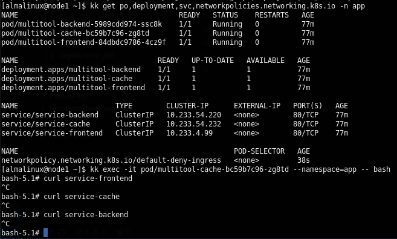
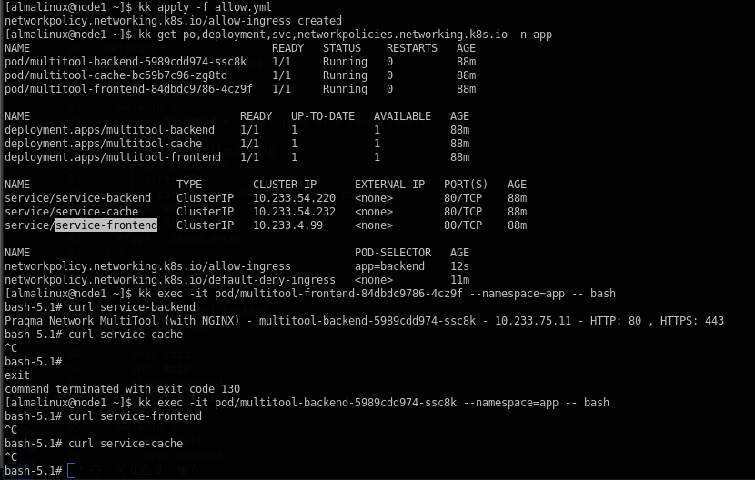
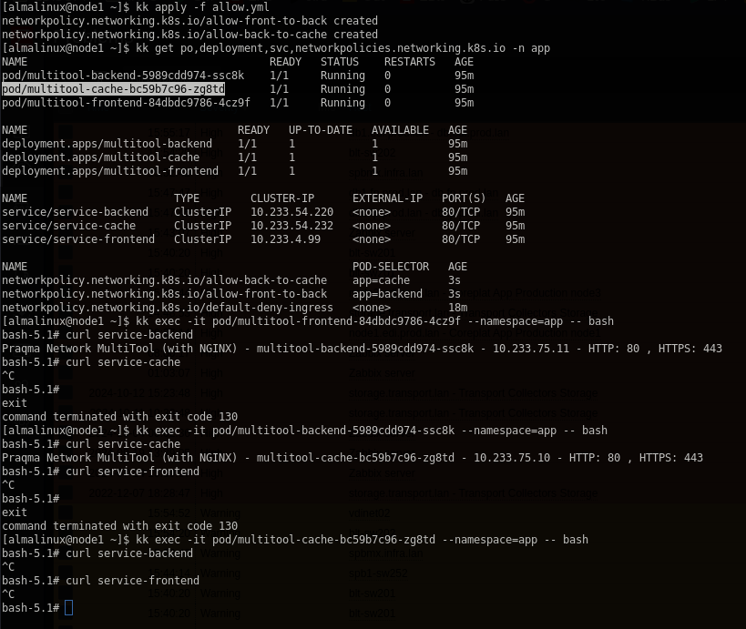

# Решение к домашнему заданию: "Как работает сеть в k8s"

>Разместить поды в namespace App.

Нельзя использовать в пространстве имен заглавные буквы!
```
[almalinux@fhm6iold5vg1kh47204n kubespray]$ kk create ns App
The Namespace "App" is invalid: metadata.name: Invalid value: "App": a lowercase RFC 1123 label must consist of lower case alphanumeric characters or '-', and must start and end with an alphanumeric character (e.g. 'my-name',  or '123-abc', regex used for validation is '[a-z0-9]([-a-z0-9]*[a-z0-9])?')
```
* [Deployment manifest file](./deployment.yml)
* [K8s network policy -- deny All](deny_all.yml)
    - Deny All traffics:\
    

* [K8s network policy -- allow specific pods](allow.yml)
    - Access from frontend to backend:
    
    - Access from backend to cache:
    
---

[Устновка кластера при помощи kubespray:](https://github.com/ValentinStupa/homeWorks/blob/main/K8s/3.2/readme.md)

---
## Requirements

| Name | Version |
|------|---------|
| <a name="requirement_terraform"></a> [terraform](#requirement\_terraform) | >=1.5 |

## Providers

| Name | Version |
|------|---------|
| <a name="provider_yandex"></a> [yandex](#provider\_yandex) | 0.123.0 |

## Modules

No modules.

## Resources

| Name | Type |
|------|------|
| [yandex_compute_instance.vm_1](https://registry.terraform.io/providers/yandex-cloud/yandex/latest/docs/resources/compute_instance) | resource |
| [yandex_compute_instance.vm_2](https://registry.terraform.io/providers/yandex-cloud/yandex/latest/docs/resources/compute_instance) | resource |
| [yandex_vpc_network.develop](https://registry.terraform.io/providers/yandex-cloud/yandex/latest/docs/resources/vpc_network) | resource |
| [yandex_vpc_subnet.develop](https://registry.terraform.io/providers/yandex-cloud/yandex/latest/docs/resources/vpc_subnet) | resource |
| [yandex_compute_image.image](https://registry.terraform.io/providers/yandex-cloud/yandex/latest/docs/data-sources/compute_image) | data source |

## Inputs

| Name | Description | Type | Default | Required |
|------|-------------|------|---------|:--------:|
| <a name="input_cloud_id"></a> [cloud\_id](#input\_cloud\_id) | https://cloud.yandex.ru/docs/resource-manager/operations/cloud/get-id | `string` | n/a | yes |
| <a name="input_default_cidr"></a> [default\_cidr](#input\_default\_cidr) | https://cloud.yandex.ru/docs/vpc/operations/subnet-create | `list(string)` | <pre>[<br>  "10.0.1.0/24"<br>]</pre> | no |
| <a name="input_default_zone"></a> [default\_zone](#input\_default\_zone) | https://cloud.yandex.ru/docs/overview/concepts/geo-scope | `string` | `"ru-central1-a"` | no |
| <a name="input_disk_size"></a> [disk\_size](#input\_disk\_size) | Disk size | `string` | `"10"` | no |
| <a name="input_folder_id"></a> [folder\_id](#input\_folder\_id) | https://cloud.yandex.ru/docs/resource-manager/operations/folder/get-id | `string` | n/a | yes |
| <a name="input_metadata"></a> [metadata](#input\_metadata) | n/a | `map(any)` | <pre>{<br>  "serial-port-enable": 1,<br>  "ssh-keys": "almalinux:ssh-ed25519 AAAAC3NzaC1lZDI1NTE5AAAAIEI4AI6/iSUW6k+H8SU5AW7z4wxVZooyapkkXa88tuL2"<br>}</pre> | no |
| <a name="input_token"></a> [token](#input\_token) | OAuth-token; https://cloud.yandex.ru/docs/iam/concepts/authorization/oauth-token | `string` | n/a | yes |
| <a name="input_vpc_image"></a> [vpc\_image](#input\_vpc\_image) | OS image name | `string` | `"almalinux-8"` | no |
| <a name="input_vpc_name"></a> [vpc\_name](#input\_vpc\_name) | VPC network & subnet name | `string` | `"k8s"` | no |
| <a name="input_vpc_platform_id"></a> [vpc\_platform\_id](#input\_vpc\_platform\_id) | Platform ID | `string` | `"standard-v3"` | no |

## Outputs

| Name | Description |
|------|-------------|
| <a name="output_instance_information"></a> [instance\_information](#output\_instance\_information) | n/a |
