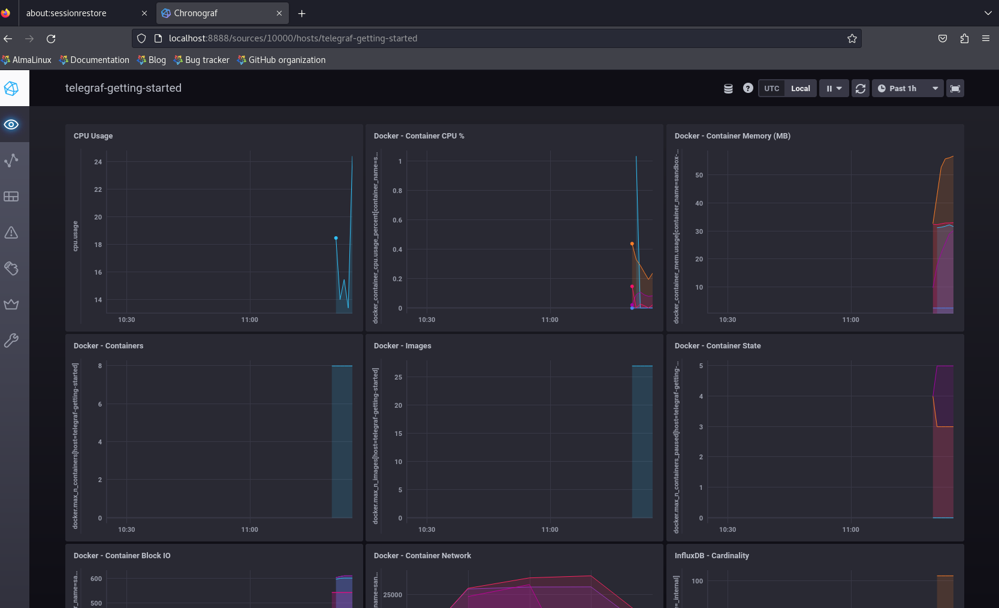
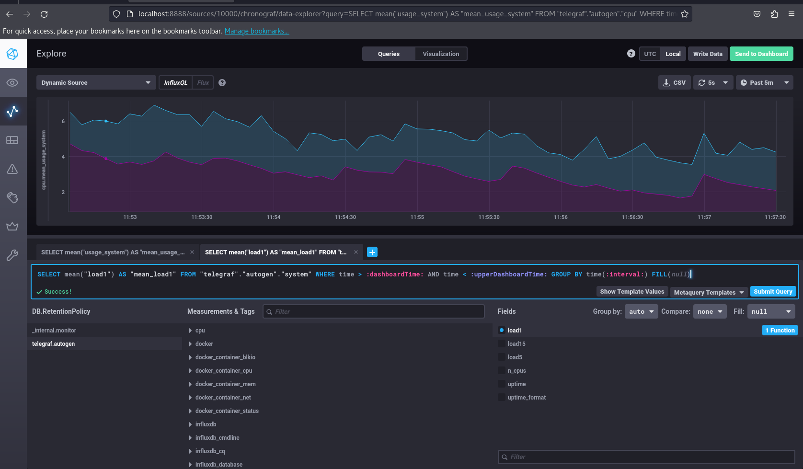
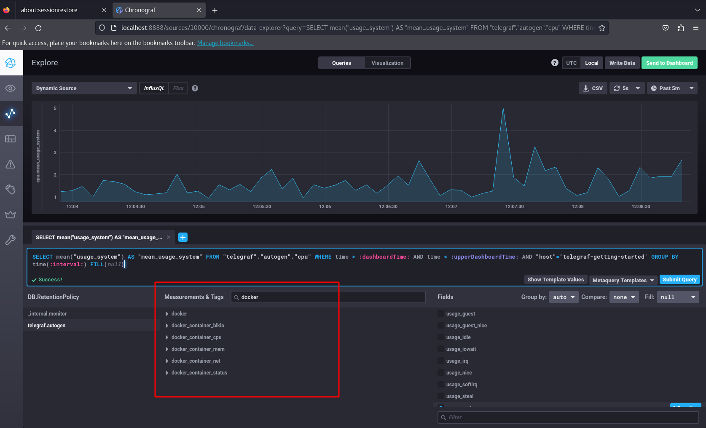

# Системы мониторинга
1. Минимальный набор метрик:
    * CPU LA -- вычисления нагружают ЦПУ
    * Mem -- потребление памяти процессами
    * Free disk space -- запись отчетов сохраняются на диск. оценка свободного места
    * I/0 -- мониторинг операций работы с диском
    * Inodes -- количество файловых декрипторов
---
2. Предложение менеджеру:
    * SLO -- Целевой уровень качества обслуживания. Целевое значение или диапазон значений.
    * SLA -- Соглашение об уровне обслуживания. Явный или неявный контракт с внешними пользователями, включающий в себя последствия невыполнения SLO.
    * SLI -- Индикатор качества обслуживания. Конкретная величина предоставляемого обслуживания.
    * Grafana -- в качестве красивого визуализатора метрик 
---
3. Решение для разработчиков:
    * Sentry -- перехватчик ошибок
    * Graylog -- получение логов и уже сортировать по нужному шаблону
---
4. Формула расчета http кодов:\
`SLI = (summ_2xx_requests + summ_3xx_requests) / summ_all_requests`
---
5. Push/Pull модели мониторинга:
>Push-модель (от англ. push - толкать) основана на принципе, что данные отправляются из источника в систему мониторинга. То есть, система мониторинга постоянно получает данные от устройств или других источников.

>Pull-модель (от англ. pull - тянуть) предполагает, что система мониторинга сама запрашивает данные у источников. То есть, система мониторит только те устройства, которые были выбраны для мониторинга, и запрашивает у них данные только тогда, когда это необходимо.

>Таким образом, push-модель обычно используется для мониторинга больших систем, где количество устройств может быть слишком большим для ручного сбора данных. Pull-модель же позволяет более гибко настраивать мониторинг, выбирая только необходимые устройства и данные, что экономит ресурсы системы мониторинга и обеспечивает более точное и своевременное обнаружение проблем.

>Кроме того, push-модели могут быть более эффективными в случаях, когда необходимо быстро реагировать на изменения в системе, так как данные поступают в систему автоматически. Однако, pull-модели могут быть предпочтительнее в случаях, когда требуется более точное обнаружение проблем и более детальный анализ данных.
---
6. Push/Pull системы мониторинга:
    * Prometheus -- pull
    * TICK -- push
    * Zabbix -- гибридный
    * VictoriaMetrics -- push?
    * Nagios -- гибридный
---
7. Запуск и работа с Tick-стэк из [Репозитория](https://github.com/influxdata/sandbox/tree/master?tab=readme-ov-file):\
Работаем от "root" пользователя\
`cd clone_repo`\
`./sandbox up`\
\
Для устранения ошибок доступа типа:\
` failed to save cluster ID: open /var/lib/kapacitor/cluster.id: permission denied"`\
или \
`open /var/lib/chronograf/chronograf-v1.db: permission denied`\
В *.conf и docker-compose.yml -- нужно поменять системные пути на /tmp/... для "kapacitor" и "chronograf"
---
8. Add Query:\

---
9. Telegraf Docker plugin(похоже был уже добавлен):\

