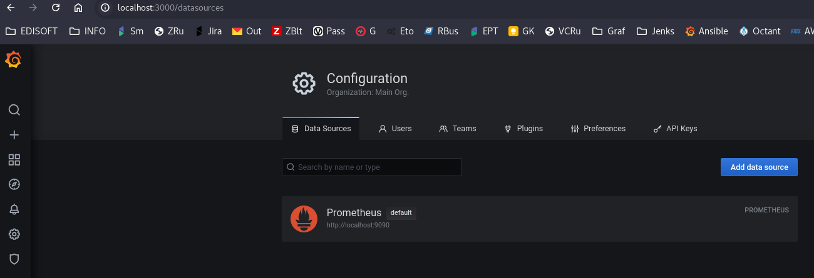
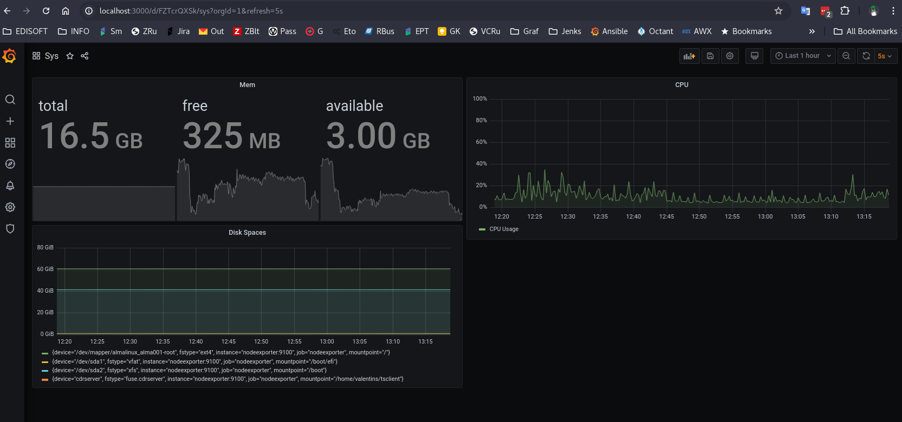
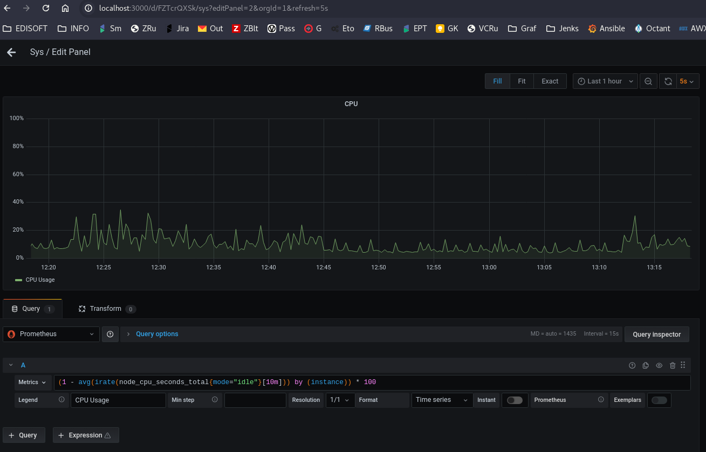
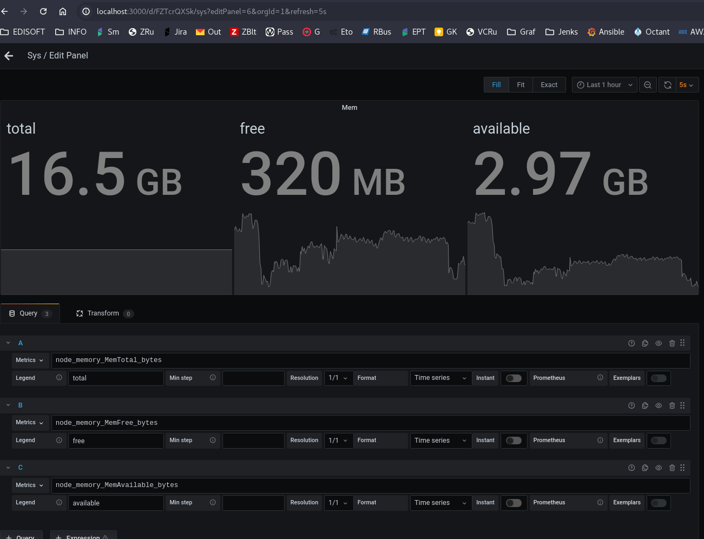
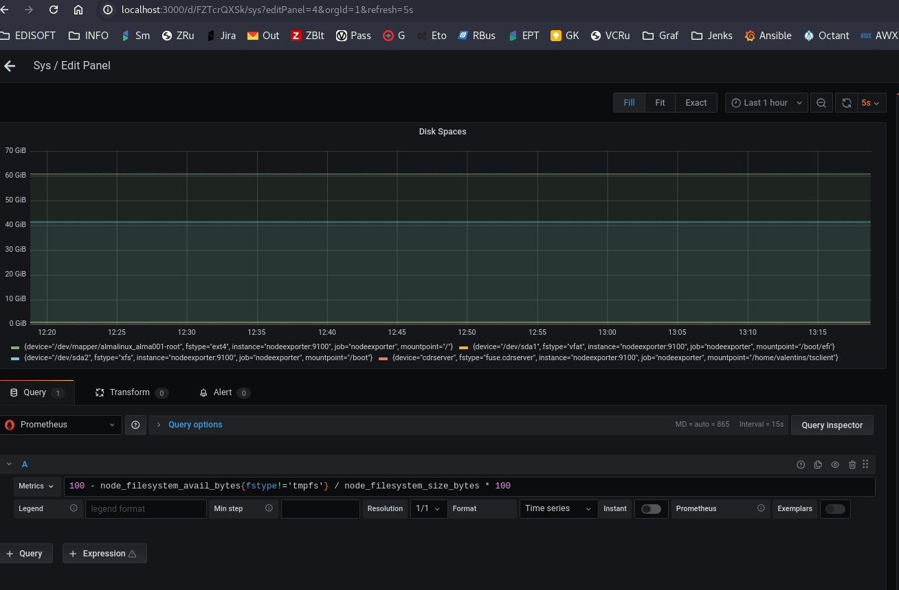
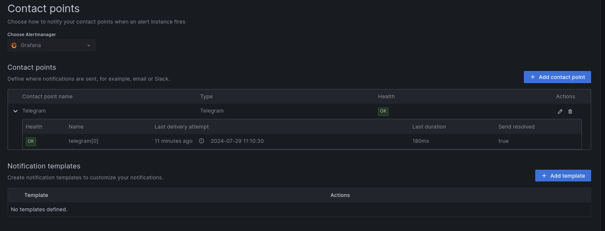
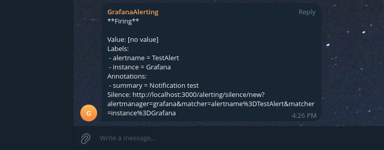
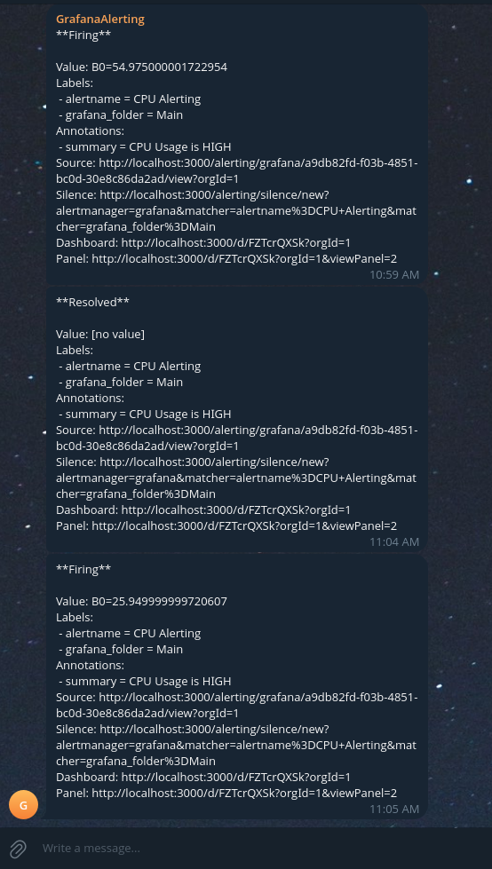
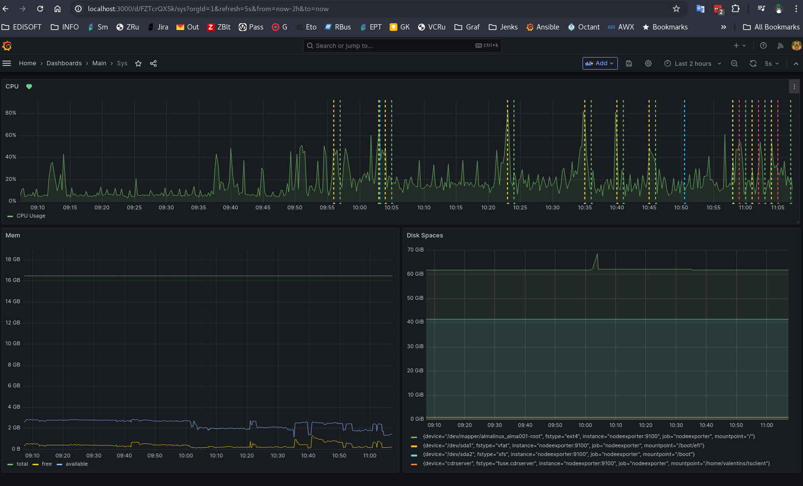

# Средство визуализации "Grafana"
1. Grafana Datasources:

---
2. Dashboard:

* Cpu query

* Mem query

* Free disk space query

---
3. Alerting:
* Contact point

* Check notification

* Alerting

* Dashboard

---
4. [Dashboard_json_config](./data/Grafana-Dashboard.json)
