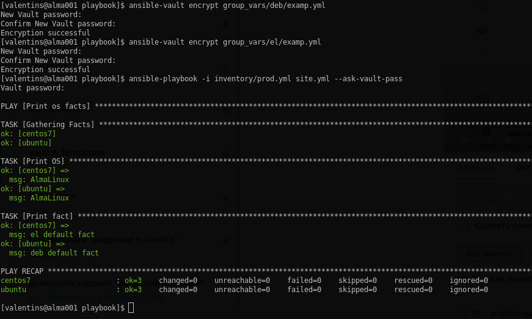

# Введение в "ansible"
## Решение к домашнему заданию 1:
- запуск тестового окружения:\

- замена значений переменных:\

- запуск прод окружения:\

- новые значения для group_vars:\

- шифрование данных при помощи "ansible-vault":\

- ansible-doc:

- новая группа хостов для прод окружения:

