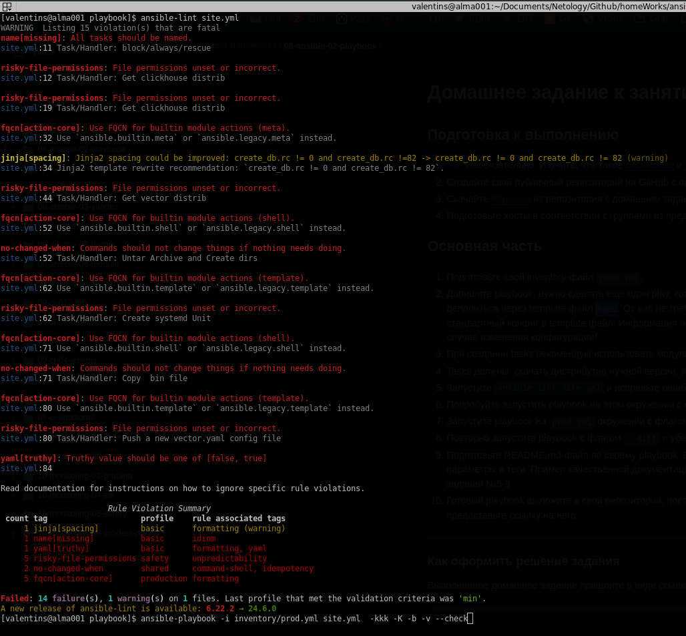
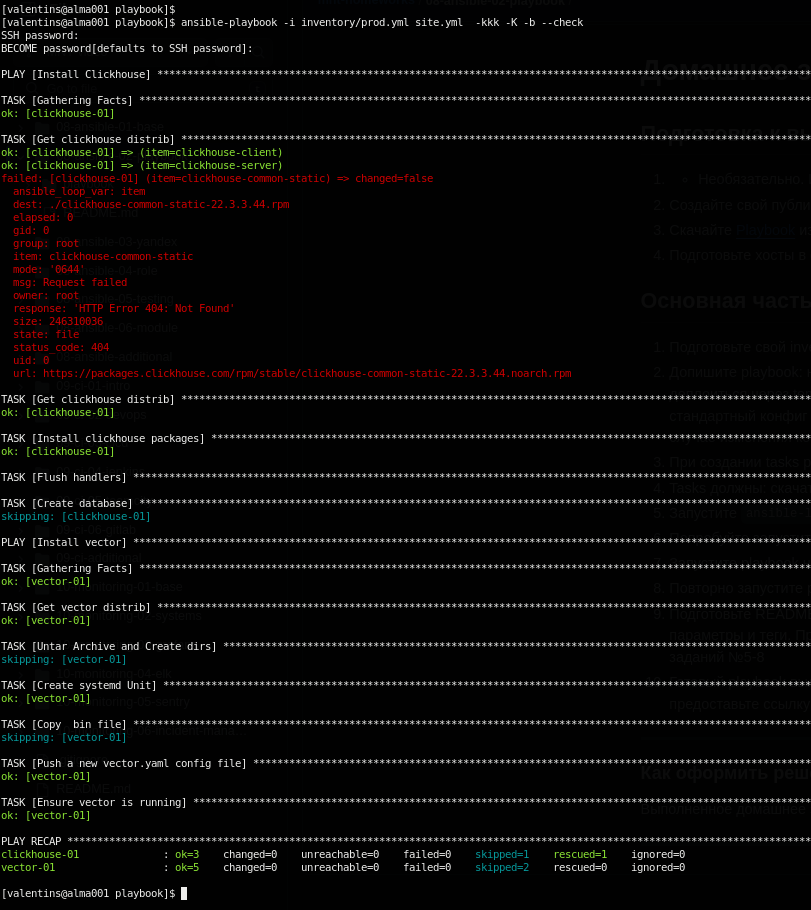
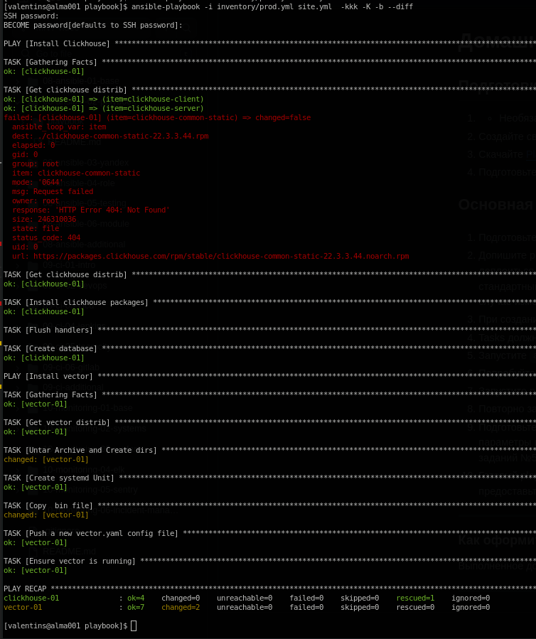
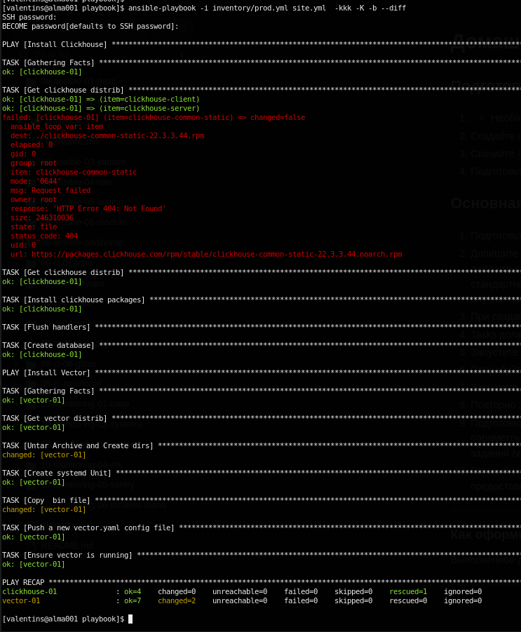

# Решение к домашнему заданию 2.
## Необходимые пакеты для работы:
```
- установит нужную версию python в систему
# sudo yum install python3.9

- установить пакеты для текущего пользователя
# pip3.9 install ansible --user
# pip3.9 install ansible-lint --user

- обновить окружение
# source ~/.bashrc
$ ansible --version
ansible [core 2.15.12]
  config file = /etc/ansible/ansible.cfg
  configured module search path = ['/home/user/.ansible/plugins/modules', '/usr/share/ansible/plugins/modules']
  ansible python module location = /home/user/.local/lib/python3.9/site-packages/ansible
  ansible collection location = /home/user/.ansible/collections:/usr/share/ansible/collections
  executable location = /home/user/.local/bin/ansible
  python version = 3.9.19 (main, May 30 2024, 13:03:52) [GCC 8.5.0 20210514 (Red Hat 8.5.0-22)] (/usr/bin/python3.9)
  jinja version = 3.1.4
  libyaml = True
$ ansible-lint  --version
ansible-lint 6.22.2 using ansible-core:2.15.12 ansible-compat:24.6.1 ruamel-yaml:None ruamel-yaml-clib:None
A new release of ansible-lint is available: 6.22.2 → 24.6.0
```
## 5 - Ansible-lint:


## 6 - Ansible --check


## 7 - Ansible --diff


## 8 - Ansible --diff 2

##