### Задание 1:
1. Terraform/docker versions:\
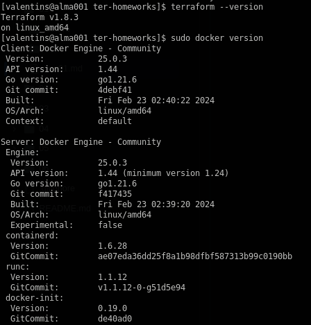
2. Sensitive data:\
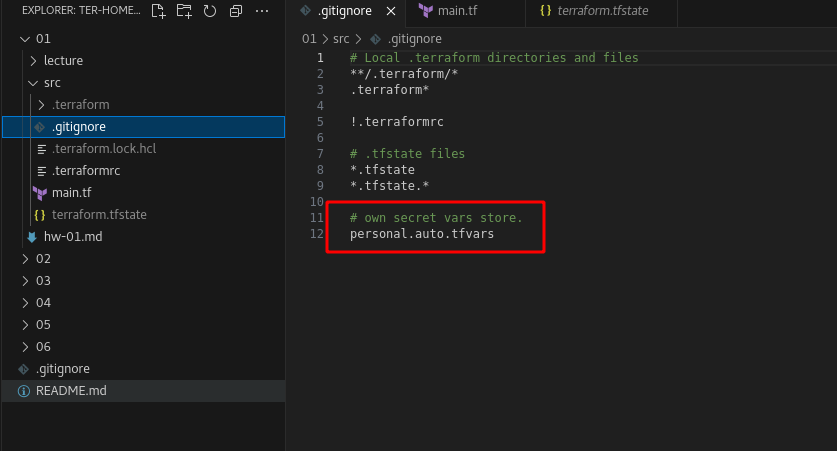
3. Secrets:
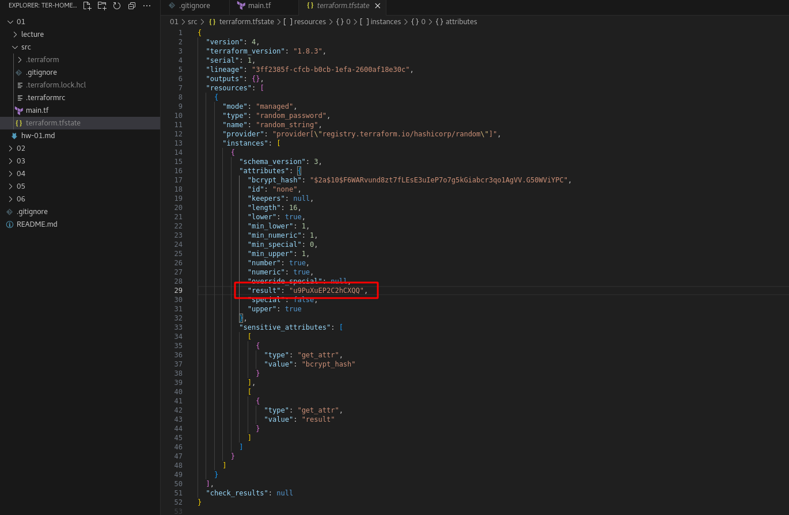
4. Не было указано имя для ресурса(24 строка), неверное имя ресурса(29 строка) и "name" на (31 строке):
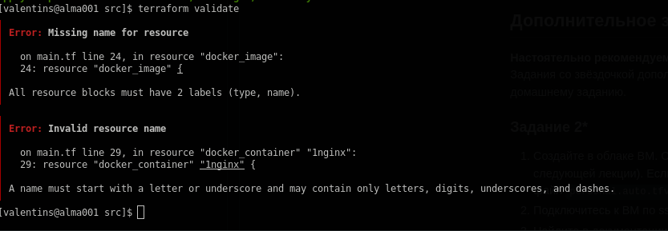
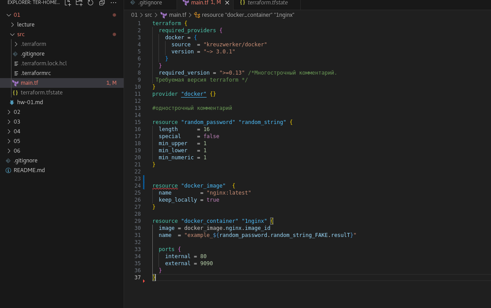
Исправлено
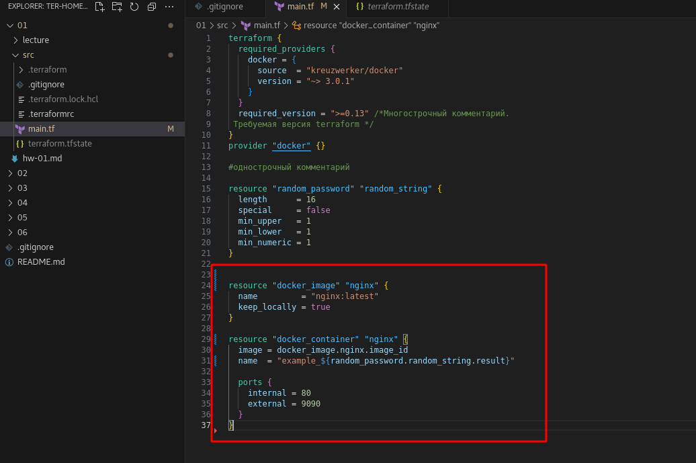
5. Запуск кода:
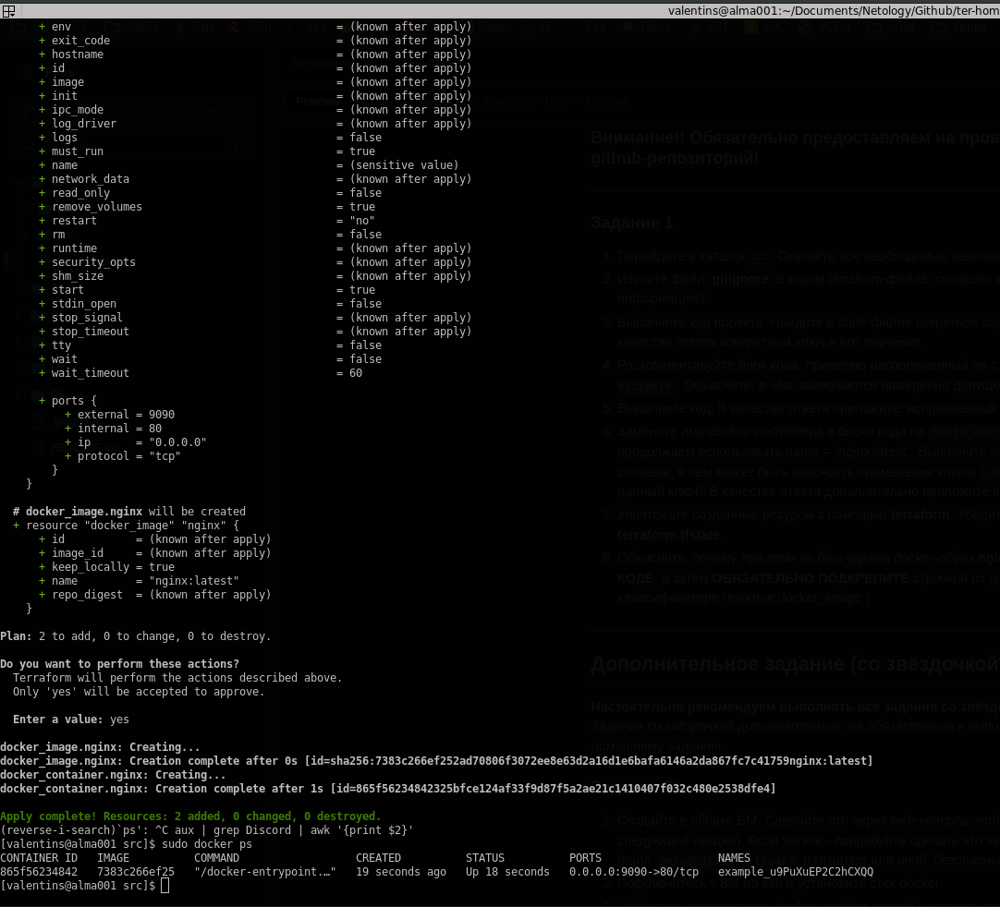
6. Замена имени docker контейнера:
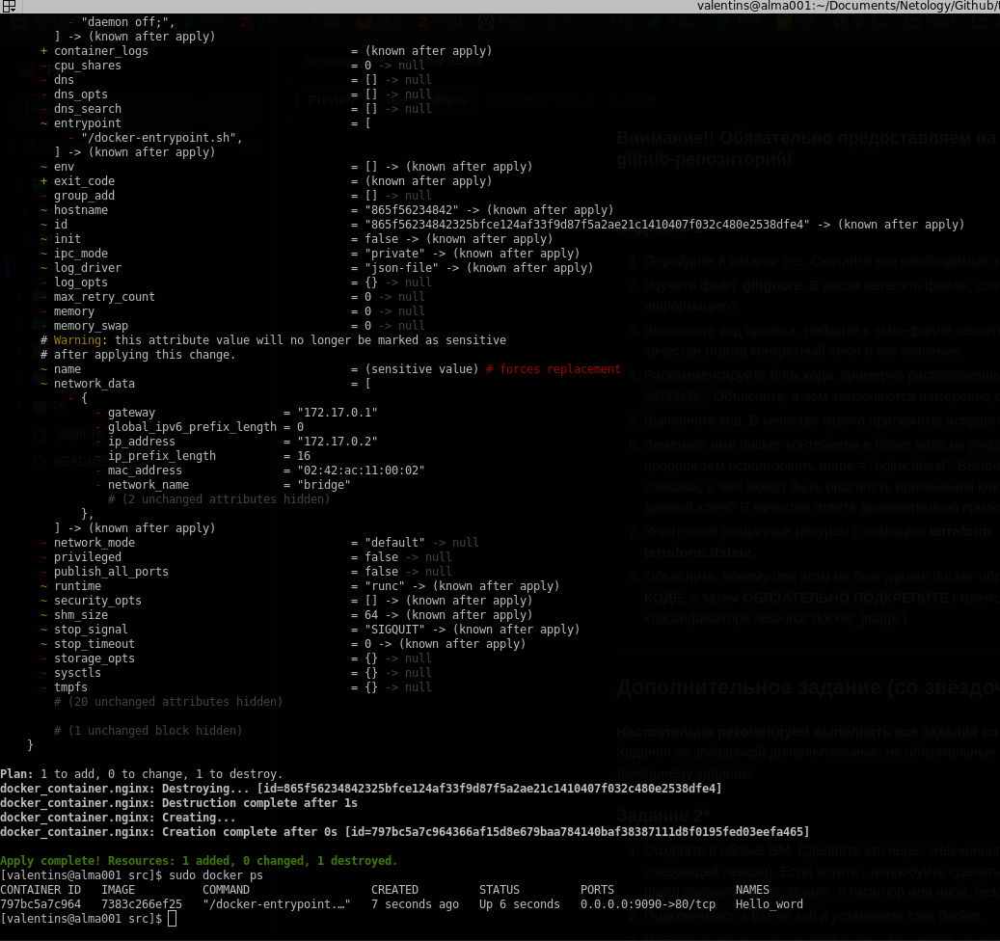
Команда "terraform apply -auto-approve" - применяет код без подверждения от пользователя.
>You can pass the -auto-approve option to instruct Terraform to apply the plan without asking for confirmation.
Warning: If you use -auto-approve, we recommend making sure that no one can change your infrastructure outside of your Terraform workflow. This minimizes the risk of unpredictable changes and configuration drift.
[terraform apply -auto-approve](https://developer.hashicorp.com/terraform/cli/commands/apply)
7. Удаление проекта:\
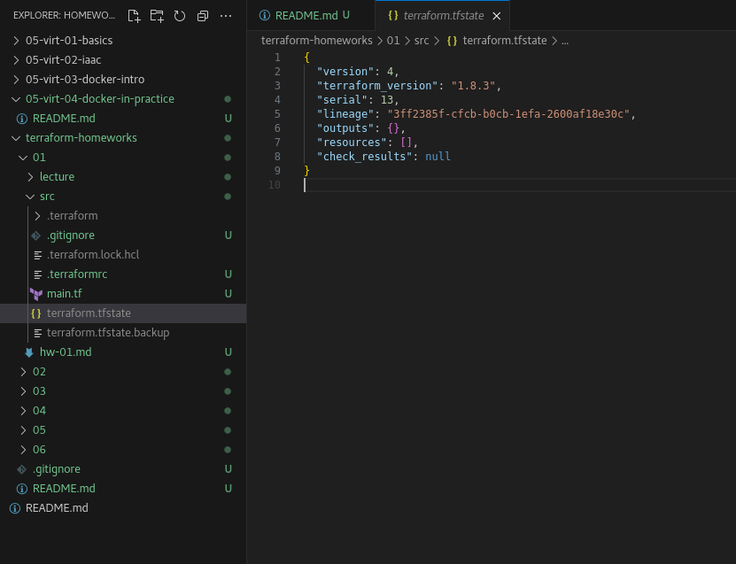
8. Образ не удаляется из-за опции "keep_locally=true"
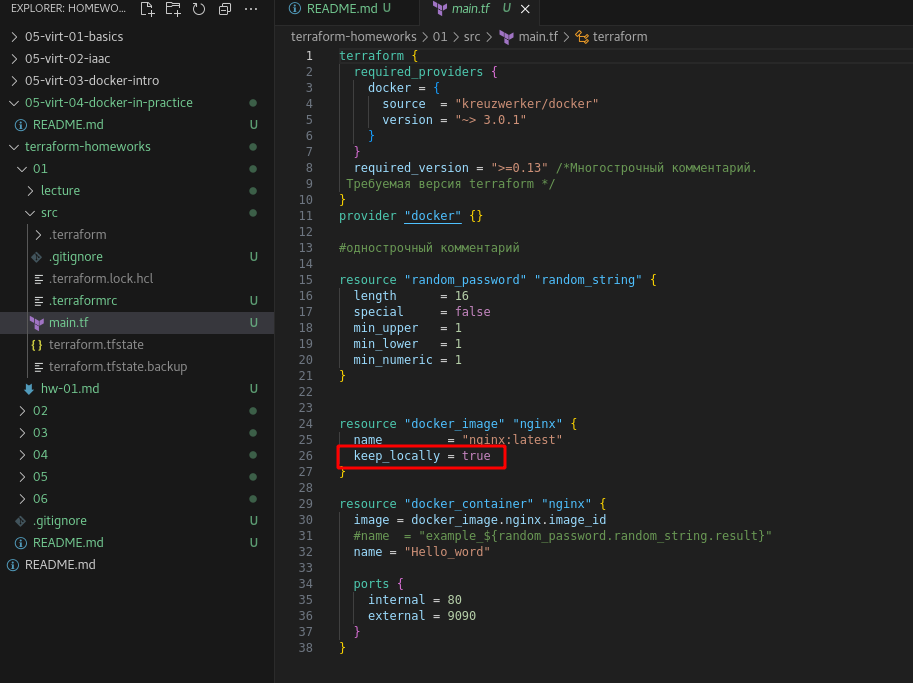
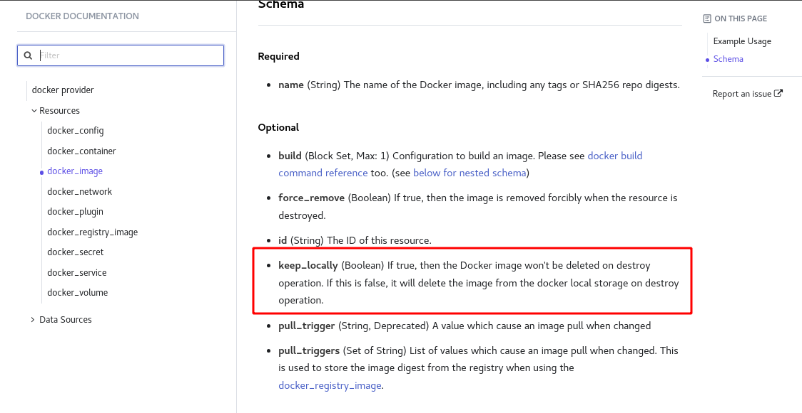

>keep_locally (Boolean) If true, then the Docker image won't be deleted on destroy operation. If this is false, it will delete the image from the docker local storage on destroy operation. [Docker_image](https://registry.terraform.io/providers/cybershard/docker/latest/docs/resources/image)
