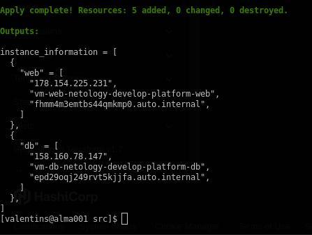

### Задание 1:
1 - Чистая виртуалка

Параметр "platform_id = standart-v4" Такого не существует
>FailedPrecondition desc = Platform "standard-v4" not found

[Platform id](https://yandex.cloud/en/docs/compute/concepts/vm-platforms)

В блоке "resources" параметр "cores = 1" -- количество ядер CPU недопустимо
>#cores         = 1 #InvalidArgument desc = the specified number of cores is not available on platform "standard-v1"; allowed core number: 2, 4

[Resources](https://terraform-provider.yandexcloud.net/Resources/compute_instance)
 
5 - Ssh connect and curl

6 -
    
    * preemptible = true -- прерываемая ВМ. Автоматически выключается согласно политике облачного провадера\

    * core_fraction = 5 -- доля использования CPU.
   
    Эти параметры помогут сэкономить деньги :)
### Задание 2:
Название в имени "vm_web_" нельзя использовать. ругается при создании

Принял в таком виде "vm-web-"\
### Задание 3:
[Configure second VM](./src/vms_platform.tf)
### Задачние 4:
[Instance information](./src/outputs.tf)\
Terraform output\

\

### Задание 5:
[Instance name](./src/locals.tf)
### Задание 6:
[VM resources](./src/vms_resources.tf)

