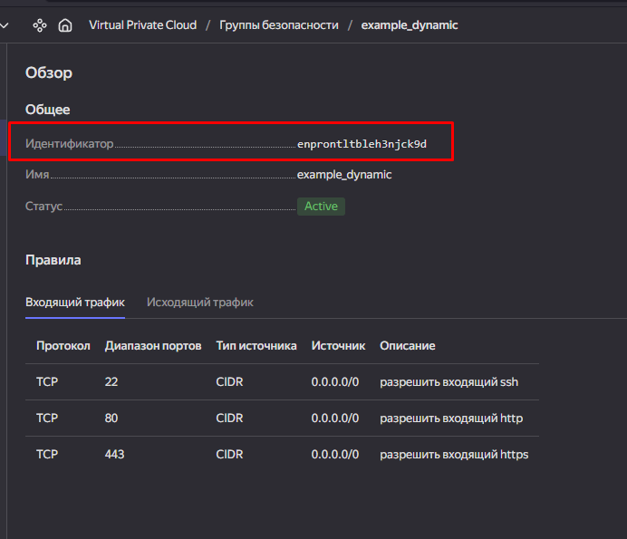
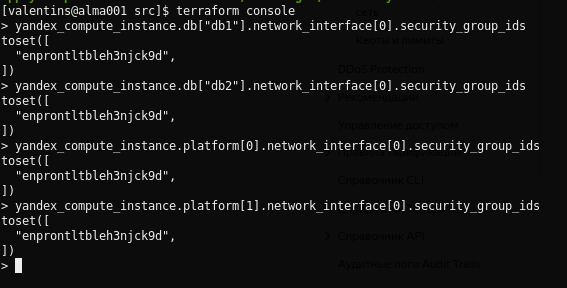
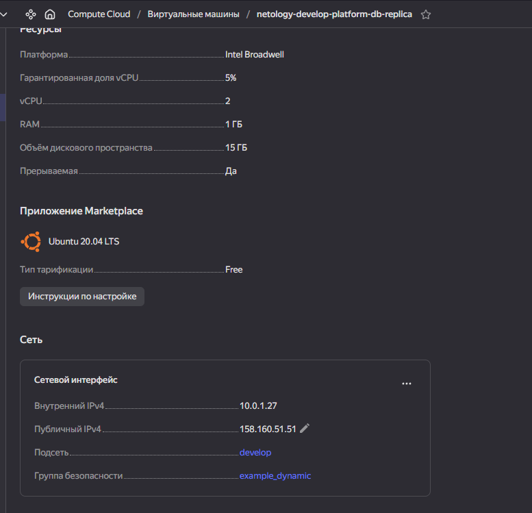
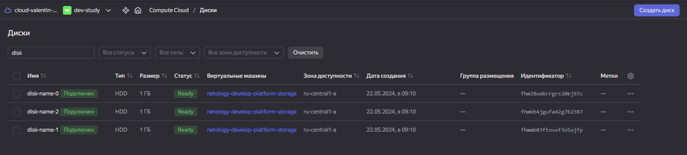
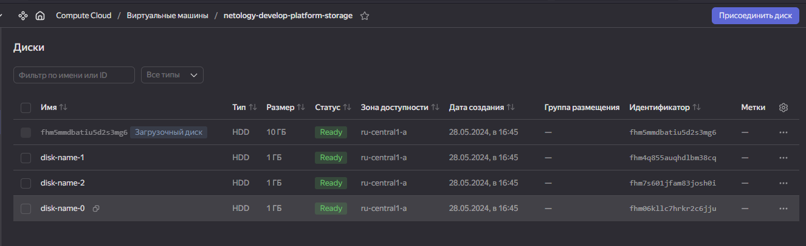
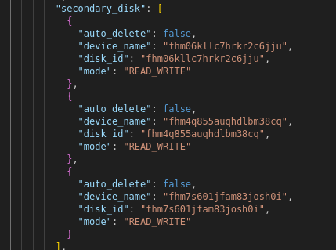

#   Весь закомментированный код оставлен для личных целей.
### Задание 1:
Security groups:

Assign the security group to VM:

----
### Задание 2:
1. Cout VM:
[count_mv](./src/count-vm.tf)
2. For each:
[for_each](./src/for_each-vm.tf)\
2.2. Local variable:
[locals](./src/locals.tf)
----
### Задание 3:
1. Create disks:

2. Attache new disk to the fresh 'storage' VM:
[storage](./src/disk_vm.tf)

----
### Задание 4:
1. Ansible inventory:
[host_cfg](./src/hosts.tftpl)
3. Fqdn:\

