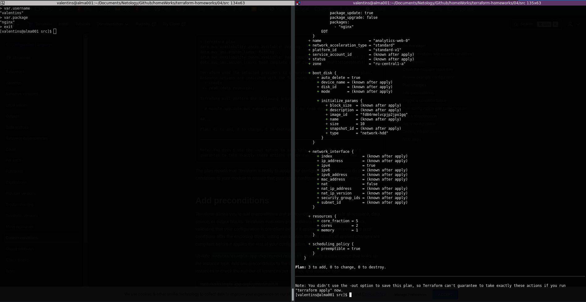

# Решение к домашнему заданию 05

## Задание 1:

- tflint:

1. Модуль использует ветку по умолчанию - main
2. Не указана версия провайдера
3. Объявлены переменные, которые не используются.\
   

- checkov:

1. CKV_YC_2 - Убедиться, что инстанц не использует публичный IP
2. CKV_YC_11 - Назначить группу безопасности сети
3. CKV_TF_1 - Использовать тэг или хэш коммита для модуля\
   \
   

## Задание 2:

\
\
\
\
\
\
\
\
\
\

## Задание 3:

[Pull request](https://github.com/ValentinStupa/homeWorks/pull/1)

## Задание 4:

- Переменные:
  \
  \
- Один IP:
  \
  \
- Список IP:
  \
  \
