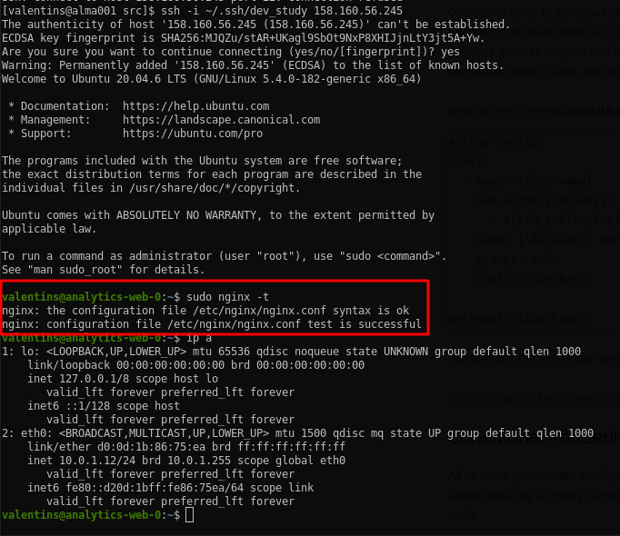

## Задание 1:
* Nginx state:\

* VM state:\


## Задание 2:
* Create network module:
[code](./modules/vpc/)
* Terraform console:\

## Задание 3:
* Remove/Import resources:\


##
## To generate use:
```docker run --rm --volume "$(pwd):/terraform-docs" -u $(id -u) quay.io/terraform-docs/terraform-docs:0.18.0 markdown /terraform-docs```
## Requirements

| Name | Version |
|------|---------|
| <a name="requirement_terraform"></a> [terraform](#requirement\_terraform) | >=0.13 |

## Providers

| Name | Version |
|------|---------|
| <a name="provider_template"></a> [template](#provider\_template) | 2.2.0 |
| <a name="provider_yandex"></a> [yandex](#provider\_yandex) | 0.119.0 |

## Modules

| Name | Source | Version |
|------|--------|---------|
| <a name="module_analytics-vm"></a> [analytics-vm](#module\_analytics-vm) | git::https://github.com/udjin10/yandex_compute_instance.git | main |
| <a name="module_marketing-vm"></a> [marketing-vm](#module\_marketing-vm) | git::https://github.com/udjin10/yandex_compute_instance.git | main |
| <a name="module_network"></a> [network](#module\_network) | ./modules/vpc | n/a |

## Resources

| Name | Type |
|------|------|
| [yandex_vpc_network.develop](https://registry.terraform.io/providers/yandex-cloud/yandex/latest/docs/resources/vpc_network) | resource |
| [yandex_vpc_subnet.develop](https://registry.terraform.io/providers/yandex-cloud/yandex/latest/docs/resources/vpc_subnet) | resource |
| [template_file.cloudinit](https://registry.terraform.io/providers/hashicorp/template/latest/docs/data-sources/file) | data source |

## Inputs

| Name | Description | Type | Default | Required |
|------|-------------|------|---------|:--------:|
| <a name="input_cloud_id"></a> [cloud\_id](#input\_cloud\_id) | https://cloud.yandex.ru/docs/resource-manager/operations/cloud/get-id | `string` | n/a | yes |
| <a name="input_default_cidr"></a> [default\_cidr](#input\_default\_cidr) | https://cloud.yandex.ru/docs/vpc/operations/subnet-create | `list(string)` | <pre>[<br>  "10.0.1.0/24"<br>]</pre> | no |
| <a name="input_default_zone"></a> [default\_zone](#input\_default\_zone) | https://cloud.yandex.ru/docs/overview/concepts/geo-scope | `string` | `"ru-central1-a"` | no |
| <a name="input_folder_id"></a> [folder\_id](#input\_folder\_id) | https://cloud.yandex.ru/docs/resource-manager/operations/folder/get-id | `string` | n/a | yes |
| <a name="input_package"></a> [package](#input\_package) | Packages | `string` | `"nginx"` | no |
| <a name="input_token"></a> [token](#input\_token) | OAuth-token; https://cloud.yandex.ru/docs/iam/concepts/authorization/oauth-token | `string` | n/a | yes |
| <a name="input_username"></a> [username](#input\_username) | User name | `string` | `"valentins"` | no |
| <a name="input_vm_db_name"></a> [vm\_db\_name](#input\_vm\_db\_name) | example vm\_db\_ prefix | `string` | `"netology-develop-platform-db"` | no |
| <a name="input_vm_web_name"></a> [vm\_web\_name](#input\_vm\_web\_name) | example vm\_web\_ prefix | `string` | `"netology-develop-platform-web"` | no |
| <a name="input_vms_ssh_root_key"></a> [vms\_ssh\_root\_key](#input\_vms\_ssh\_root\_key) | ssh-keygen -t ed25519 | `string` | `"your_ssh_ed25519_key"` | no |
| <a name="input_vpc_name"></a> [vpc\_name](#input\_vpc\_name) | VPC network&subnet name | `string` | `"develop"` | no |

## Outputs
